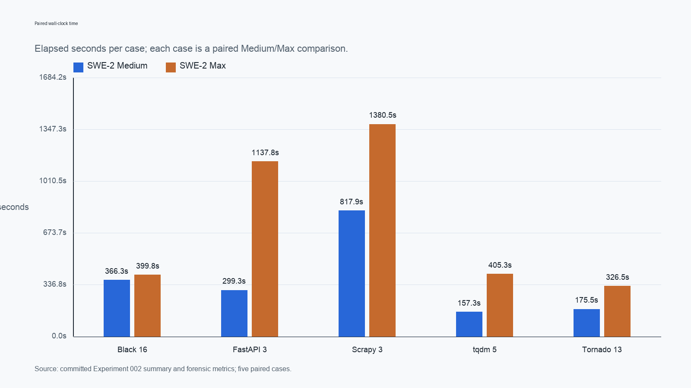
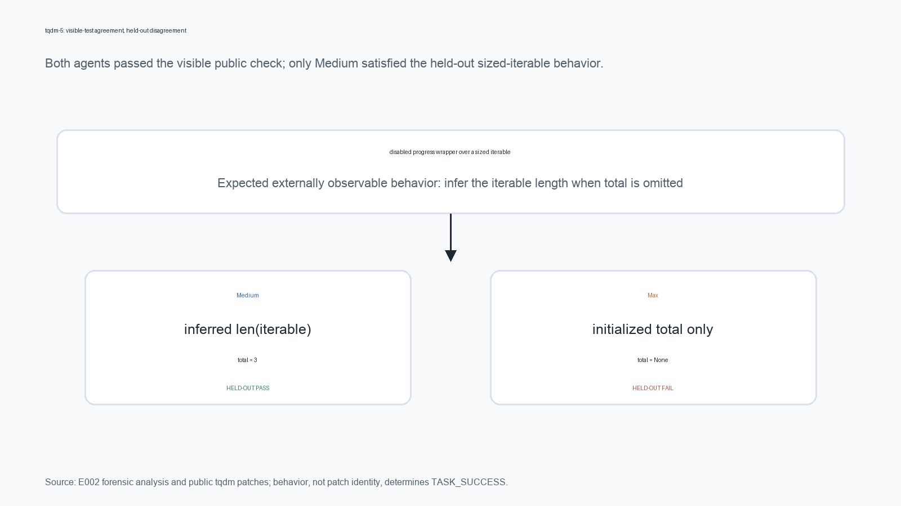
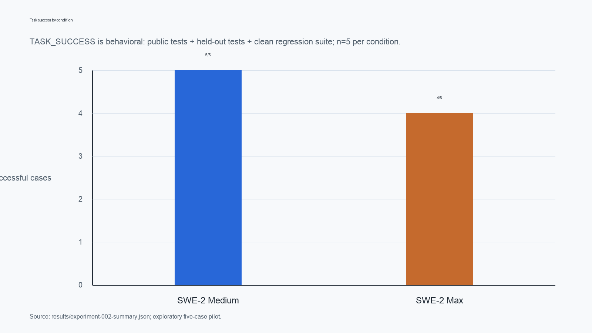

# Devin + SWE-2 Reasoning Effort Benchmark

An independent, reproducible evaluation of Cognition's Devin agent on paired
software-repair tasks from historical/public and newly constructed/withheld
case sets. The final V4 primary benchmark compares SWE-2 Medium and SWE-2 Max
across three balanced difficulty tiers with identical prompts within each pair,
fresh sanitized workspaces, hidden evaluator tests, and zero substantive
intervention.

**Publications:** [v4.0.0 — three difficulty tiers](https://github.com/MAJORminorStudio/devin-agent-benchmark/releases/tag/v4.0.0) · [v3.0.0 — moderate and hard tiers](https://github.com/MAJORminorStudio/devin-agent-benchmark/releases/tag/v3.0.0) · [v2.0.0 — ten-case paired pilot](https://github.com/MAJORminorStudio/devin-agent-benchmark/releases/tag/v2.0.0) · [v1.0.0 — first public research release](https://github.com/MAJORminorStudio/devin-agent-benchmark/releases/tag/v1.0.0)

## V4 final primary benchmark

The completed V4 benchmark contains **30 unique primary bugs and 60 valid
paired runs** across three balanced difficulty tiers. Each tier has five
historical/public and five newly constructed/withheld cases. The aggregate
totals are nearly tied, but the paired relationship changes with difficulty:

| Tier | SWE-2 Medium | SWE-2 Max | Unique bugs | Valid runs |
|---|---:|---:|---:|---:|
| Moderate (E002 + E004) | **10/10** | **8/10** | 10 | 20 |
| Hard (E005) | **7/10** | **6/10** | 10 | 20 |
| Very-hard (E006) | **7/10** | **9/10** | 10 | 20 |
| **Primary total** | **24/30** | **23/30** | **30** | **60** |

The [V4 final research report](reports/devin-swe2-reasoning-effort-v4-final.md),
[machine-readable summary](results/publication-v4-summary.json),
[paired CSV](results/publication-v4-paired-results.csv),
[run CSV](results/publication-v4-runs.csv), [tier summary](results/publication-v4-tier-summary.csv),
and [publication charts](artifacts/publication-v4/README.md) are the canonical
publication paths. E003 remains supplemental easier withheld evidence; E001
remains methodological provenance and is not counted in the primary denominator.

For the short external-reader path, start with the [final report](reports/devin-swe2-reasoning-effort-v4-final.md),
then inspect the [machine-readable data](results/publication-v4-summary.json),
[sanitized evidence](artifacts/publication-v4/README.md), and the
[v4.0.0 release](https://github.com/MAJORminorStudio/devin-agent-benchmark/releases/tag/v4.0.0).
The companion [MAJOR//minor article](https://majorminor.xyz/blog/value-of-more-reasoning-changed-with-difficulty)
provides the narrative overview.

The central result is not a universal winner claim: Medium leads on the
moderate and hard tiers, while Max leads at very-hard difficulty with two
Max-only repairs and no Medium-only repairs. Additional reasoning effort
changed observable repair trajectories and resource use, but did not provide
a uniform correctness benefit across the curve.

## V3 primary balanced benchmark

The completed V3 benchmark contains **20 unique bugs and 40 valid paired
runs** across two tiers, each split between five historical/public and five
newly constructed/withheld cases:

| Tier | SWE-2 Medium | SWE-2 Max | Unique bugs | Valid runs |
|---|---:|---:|---:|---:|
| Moderate (E002 + E004) | **10/10** | **8/10** | 10 | 20 |
| Hard (E005) | **7/10** | **6/10** | 10 | 20 |
| Primary total | **17/20** | **14/20** | 20 | 40 |

The hard tier included one Max-only repair, two Medium-only repairs, and two
cases that defeated both conditions. Paired outcomes are mixed; this is an
exploratory benchmark, not a general superiority claim. The [V3 research
report](reports/devin-swe2-reasoning-effort-v3.md), [summary](results/publication-v3-summary.json),
[40-run CSV](results/publication-v3-runs.csv), [paired CSV](results/publication-v3-paired-results.csv),
and [sanitized evidence](artifacts/experiment-005/README.md) are the shortest
paths into the publication.

The [E005 hard-tier report](reports/experiment-005-results.md) contains the
complete hard-tier ledger and failure analysis. E003 remains supplemental
easier withheld evidence; E001 remains methodological provenance and is not
counted in the primary denominator.

## E006 very-hard completion

Experiment 006 was the frozen **VERY-HARD capability-frontier** tier: 10 unique
cases (five historical/public and five newly constructed/withheld), 20
balanced `swe-2-medium`/`swe-2-max` runs, and a fixed interleaved order. See the
[protocol](docs/experiment-006-protocol.md), [candidate survey](docs/experiment-006-historical-candidate-survey.md),
[evaluation contract](docs/experiment-006-evaluation.md),
[configuration](manifests/experiment-006-config.json), [run order](manifests/experiment-006-runs.json),
and [hash-only freeze record](manifests/experiment-006-freeze.json). The
original prelaunch dependency gate failed before execution; the immutable
runtime was repaired and re-frozen in the current infrastructure freeze. The
frozen execution completed once per run with no retries, timeouts, or
in-protocol evaluator incidents. See the [E006 results](reports/experiment-006-results.md)
and the [combined analysis](reports/experiment-002-004-005-006-combined-analysis.md).

## V2 study

The completed v2 study combines five historical BugsInPy cases from E002 with
five newly constructed, withheld cases from E003: **10 unique bugs and 20
valid paired runs**. Medium scored **10/10** and Max **9/10**. E003 itself was
a 5/5 versus 5/5 tie; the only correctness disagreement was the historical
`tqdm-5` case. Max used more wall time in all ten pairs. See the [v2 research
report](reports/devin-swe2-reasoning-effort-v2.md), [v2 data](results/publication-summary-v2.json),
[paired CSV](results/publication-paired-results-v2.csv), and [public E003
evidence](artifacts/experiment-003/README.md).

## Key result

| Metric | SWE-2 Medium | SWE-2 Max |
|---|---:|---:|
| Behavioral success | **5/5** | **4/5** |
| Mean wall time | 363s | 730s |
| Observable steps | 199 | 274 |
| Prompt tokens | 4.12M | 11.74M |
| Completion tokens | 52.3K | 165.0K |

In this five-case paired pilot, Max consumed substantially more time and model
activity without improving aggregate repair accuracy. This is an exploratory
result at n=5, not a statistical superiority study or a general claim about
Devin, SWE-2, or reasoning effort.



## Paired results

| Case | Medium | Max | Medium wall | Max wall | Held-out disagreement |
|---|---:|---:|---:|---:|---|
| Black 16 | pass | pass | 366.3s | 399.8s | — |
| FastAPI 3 | pass | pass | 299.3s | 1,137.8s | — |
| Scrapy 3 | pass | pass | 817.9s | 1,380.5s | — |
| tqdm 5 | pass | **fail** | 157.3s | 405.3s | Max left the inferred total unset |
| Tornado 13 | pass | pass | 175.5s | 326.5s | — |

Four pairs succeeded under both conditions. One pair was Medium-only; no pair
was Max-only or failed under both conditions. See the
[standalone historical report](reports/swe-2-medium-vs-max-research-report.md)
and [complete v2 report](reports/devin-swe2-reasoning-effort-v2.md)
for the complete case analysis and charts.

## The disagreement: tqdm-5

Both agents passed the visible public test. The independent held-out test
checked the externally observable contract for a disabled progress wrapper
around a sized iterable. Medium inferred `len(iterable)` and passed; Max
initialized `total` but left it `None`, so it failed the held-out assertion.
The result illustrates why public-test success alone is not sufficient for
this benchmark.



## Why Experiment 001 matters

Experiment 001 used the same five cases and paired model conditions, but its
noninteractive `accept-edits` permission mode still required shell
confirmation. Confirmation was unavailable in unattended execution, so
required tool calls were rejected in all ten runs and every patch was empty.
E001 is therefore preserved as operational provenance, not as a capability
comparison. Experiment 002 corrected only this execution boundary by using
dangerous/effective Bypass inside a disposable isolated Docker environment;
no permission-related tool rejection occurred in E002.



Permission policy is part of the effective autonomous-agent system. The full
forensic account is in the [E002 forensic analysis](reports/experiment-002-forensic-analysis.md).

## Methodology

- Five historical BugsInPy bugs with known buggy and fixed revisions.
- Identical frozen prompts within each Medium/Max pair.
- Fresh sanitized workspace for every run; the reference patch and held-out
  tests stayed evaluator-side.
- One interleaved frozen order, no retries, and no substantive assistance.
- Session closed before evaluation; TASK_SUCCESS required public tests,
  held-out target tests, and a clean regression suite.
- Experiment 002 used a disposable Linux/arm64 Docker container with a
  read-only root, dropped capabilities, no-new-privileges, no Docker socket,
  no control-repository mount, a single workspace, and restricted egress.

The harness is intentionally isolated from the lab's unrelated systems and
production work. BugsInPy is an external checkout and is not vendored here.

## Evidence and reproduction

Start with the [full research report](reports/swe-2-medium-vs-max-research-report.md),
then follow its evidence links to the [E002 results](reports/experiment-002-results.md),
[forensic analysis](reports/experiment-002-forensic-analysis.md),
[per-run public artifacts](artifacts/experiment-002/README.md), prompts,
sanitized timelines, patches, and evaluator results. E001 is available as
[invalid capability-comparison provenance](reports/experiment-001-results.md)
with its [public artifacts](artifacts/experiment-001/README.md).

Machine-readable publication data are in
[results/publication-summary.json](results/publication-summary.json) and
[results/publication-paired-results.csv](results/publication-paired-results.csv).
The committed source data are [the E002 summary](results/experiment-002-summary.json),
[the forensic JSON](results/experiment-002-forensics.json), and the frozen
[E002 configuration](manifests/experiment-002-config.json).

To rebuild the publication derivatives without invoking Devin:

```sh
python3 scripts/build_publication_assets.py
python3 -m unittest discover -s tests -p 'test_*.py'
```

The chart builder requires Pillow. No command above runs a benchmark case or
contacts Devin. The public artifact policy and safe evidence boundary are
documented in the [research report](reports/swe-2-medium-vs-max-research-report.md)
and [methodology](docs/methodology.md).

## Limitations

This is a five-case historical Python pilot, one agent product/model family,
and one frozen task setup. Cost and ACU data were unavailable. Public
benchmark exposure or contamination cannot be ruled out absolutely. The
results are exploratory and do not establish that either condition is
generally superior, that more reasoning causes worse coding performance, or
that the observed resource differences will generalize.

## Repository map

| Path | Contents |
|---|---|
| `cases/` | Case-source conventions and workspace notes |
| `manifests/` | Frozen configurations and evaluator-side ground truth |
| `prompts/` | Frozen task prompts |
| `evaluation/` | Held-out tests and scoring metadata |
| `artifacts/` | Sanitized public per-run evidence |
| `results/` | Canonical summaries and publication data |
| `reports/` | Detailed experiment, forensic, and publication reports |
| `scripts/` | Preparation, export, evaluation, analysis, and chart tools |
| `docs/` | Methodology, isolation, and protocol documentation |
| `assets/charts/` | V1/V2 publication figures derived from committed results |
| `assets/charts-v3/` | V3 figures derived from the primary E002/E004/E005 results |

## Status

Experiment 001 is retained as invalid capability-comparison provenance.
Experiments 002 and 004 form the moderate primary tier; Experiment 005 is the
hard primary tier; Experiment 003 is supplemental easier withheld evidence.
See the [V3 report](reports/devin-swe2-reasoning-effort-v3.md),
[CITATION.cff](CITATION.cff), and [third-party notices](THIRD_PARTY_NOTICES.md)
for reuse boundaries.
