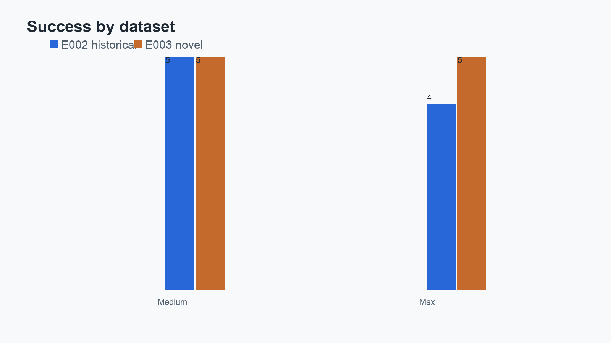
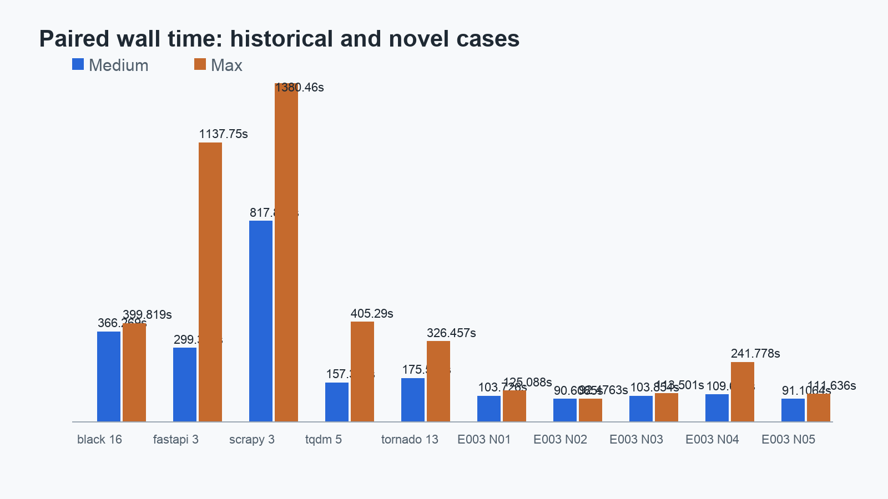
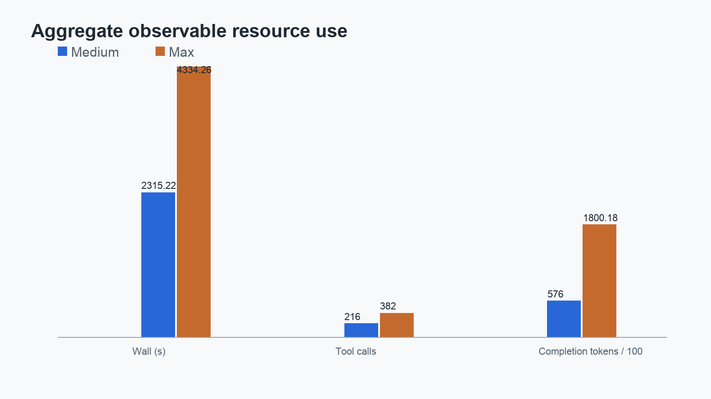
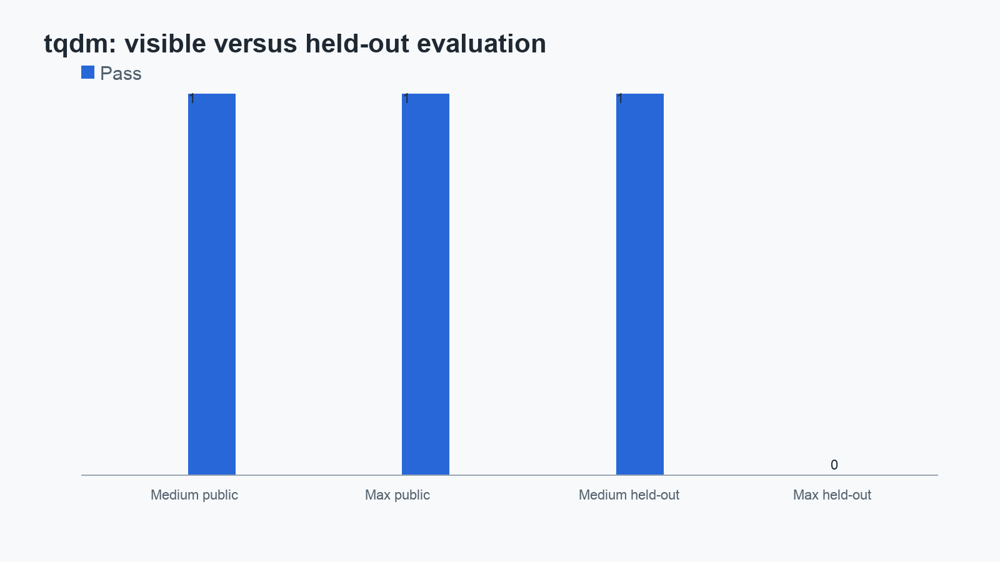

# Devin + SWE-2 Reasoning Effort: A Ten-Case Paired Pilot

## Abstract

We ran a small paired evaluation of Cognition's Devin using SWE-2 Medium and
SWE-2 Max on ten software-repair tasks. Five tasks came from the historical
BugsInPy benchmark and five were newly constructed for this study. The
historical set produced the original Medium 5/5 versus Max 4/5 result. The
novel set was a replication challenge: its cases, defects, prompts, reference
fixes, and held-out behavioral tests were constructed and withheld until the
protocol was frozen and execution began. On those five cases both conditions
scored 5/5.

Across the combined ten-case capability denominator, Medium scored 10/10 and
Max scored 9/10. The only correctness disagreement was the historical `tqdm-5`
case. Max passed the visible public and regression tests but failed the
held-out behavioral assertion; Medium passed all three evaluator components.
The novel set therefore did not reproduce the E002 correctness disagreement.

Resource observations were more consistent than correctness differences. Max
used more wall time in all five historical pairs and all five novel pairs. In
the combined data it used 4,334.260 seconds versus Medium's 2,315.220, 382
tool calls versus 216, and 180,018 completion tokens versus 57,600. These are
observed activity measures, not measures of hidden reasoning. This exploratory
study has ten unique cases, one agent product, one model family, and no basis
for a general superiority claim.

## Questions

The study asks two related questions:

1. Does the E002 Medium-versus-Max result replicate on five newly constructed
   defects withheld from Devin before execution?
2. Across historical and novel cases, how do the conditions compare on
   behavioral success and observable work: wall time, steps, tool calls,
   prompt tokens, completion tokens, and source patch size?

The first question is a replication challenge, not a new claim that a model
has or has not seen a particular pattern during training. The supported
novelty claim is about the provenance and withholding of the E003 artifacts.

## Why add a novel set?

The first public article reported a five-case historical pilot. Those cases
were real BugsInPy repairs with public upstream histories. That makes them
useful software tasks, but it also leaves an obvious question about how much
historical exposure can explain an individual result. We therefore kept the
original result intact and added a separate five-case set designed specifically
to challenge it.

E003 cases cover filesystem/path semantics, stateful cache invalidation,
nested data transformation, asynchronous lifecycle behavior, and a
line-protocol state machine. Each case is a small Python repository with a
visible failing test, an evaluator-side held-out behavior test, a nearby
regression test, a fixed source tree, and a reference patch. The cases were
withheld until the E003 protocol and freeze manifest were complete and
execution began. That establishes experiment-specific construction and
withholding; it does not establish absence from model training data.

## Methodology

E002 and E003 used one interleaved frozen order. Every case was run once with
`swe-2-medium` and once with `swe-2-max`, with no retries and zero substantive
intervention. The prompt within each pair was byte-identical. Each run began
from a fresh sanitized buggy workspace. Devin could see the task workspace and
its task prompt, but not evaluator tests, fixed source, reference patches,
prior results, or the control repository.

E002 used the corrected isolated execution boundary: a disposable Linux/arm64
Docker container, dangerous permission mode with effective Bypass inside the
container, read-only root filesystem, dropped capabilities,
`no-new-privileges`, no Docker socket, no host or control-repository mounts,
one minimum credential mount, and restricted service egress. E003 reused that
boundary for its standard-library-only cases. The session was closed before
the evaluator accessed the workspace.

TASK_SUCCESS was fixed before execution. It is one only when the public test,
the evaluator-side held-out target behavior test, and the practical regression
suite all pass. An evaluator infrastructure problem is recorded separately as
`EVALUATION_ERROR`; it is not silently converted to an agent failure. The
evaluator also records the final patch, source versus workspace churn,
observable steps and tool calls, prompt/completion/cached tokens when exposed,
timing, termination, and intervention count.

The held-out tests are behavior-oriented. They were not placed in Devin's
workspace and are now published only because all E003 runs are closed. For
E002, the evaluator-side tests were likewise kept outside the agent workspace.
The human/reference patch was consulted only after both conditions for a case
were closed; patch identity was never required for success.

## E001: operational provenance, not a capability result

The initial ten E001 attempts used noninteractive `accept-edits` permission
handling. Required tool calls were rejected because unattended confirmation
was unavailable, leaving every patch empty. E001 is preserved because it
documents a real failure mode at the execution boundary, but its zeros are
excluded from the capability denominator. E002 corrected that boundary inside
disposable isolation. No permission-related tool rejection occurred in E002
or E003.

## Results by dataset

| Dataset | Cases | Medium | Max | Both succeeded | Medium only | Max only | Both failed |
|---|---:|---:|---:|---:|---:|---:|---:|
| E002 historical BugsInPy | 5 | 5/5 | 4/5 | 4 | 1 | 0 | 0 |
| E003 novel, withheld | 5 | 5/5 | 5/5 | 5 | 0 | 0 | 0 |
| Combined | 10 | 10/10 | 9/10 | 9 | 1 | 0 | 0 |

E003 is the important replication result: the correctness disagreement did
not recur. Both conditions passed every public, held-out, and regression
evaluation on all five novel cases. Across all ten cases, however, the
historical Medium-only outcome remains part of the observed combined result.

## Observable work

The combined resource totals are derived from the per-run machine-readable
records, not rounded article prose.

| Condition | Wall total / mean / median (s) | Steps | Tool calls | Prompt tokens | Completion tokens | Source lines |
|---|---:|---:|---:|---:|---:|---:|
| Medium | 2,315.220 / 231.522 / 133.464 | 276 | 216 | 4,681,222 | 57,600 | +57 / -20 |
| Max | 4,334.260 / 433.426 / 284.118 | 352 | 382 | 12,366,076 | 180,018 | +55 / -20 |

Max took longer in all ten paired comparisons. It used more tool calls in the
historical set and in four of five novel pairs; the one novel exception was
E003-N01. Max's steps were higher in the combined total, but the per-pair
step direction was mixed. Prompt and completion tokens were higher in
aggregate for Max. Costs and ACUs were not exposed by the captured interface.

The source patch totals are close and should not be confused with workspace
churn. E002's agents sometimes created large dependency or environment trees;
those files were tracked separately from source edits. E003 had zero generated
or environment files in the final diffs. Observable work therefore points to
a difference in execution activity, not necessarily a larger final code
change.

## Per-case results

The complete ten-row machine-readable table is in
[`results/publication-paired-results-v2.csv`](../results/publication-paired-results-v2.csv).
The summary below keeps the pair outcomes and notable context visible.

| Case | Provenance | Medium | Max | Max minus Medium wall (s) | Held-out note |
|---|---|---:|---:|---:|---|
| Black 16 | historical | pass | pass | +33.550 | no disagreement |
| FastAPI 3 | historical | pass | pass | +838.418 | no disagreement |
| Scrapy 3 | historical | pass | pass | +562.603 | no disagreement |
| tqdm 5 | historical | pass | fail | +247.978 | Max visible pass, held-out fail |
| Tornado 13 | historical | pass | pass | +150.922 | no disagreement |
| E003-N01 | novel | pass | pass | +21.362 | no disagreement |
| E003-N02 | novel | pass | pass | +1.868 | no disagreement |
| E003-N03 | novel | pass | pass | +9.647 | no disagreement |
| E003-N04 | novel | pass | pass | +132.163 | no disagreement |
| E003-N05 | novel | pass | pass | +20.529 | no disagreement |

The `tqdm-5` result is worth retaining because it separates visible test
completion from behavioral correctness. Both agents passed the public test;
the held-out check exercised the externally observable total of a disabled
progress wrapper around a sized iterable. Medium passed. Max left the inferred
total unset and failed that hidden assertion while passing its public and
regression checks. This is a single case, not evidence of a general pattern.

## Interpretation

Observed: Medium scored 10/10 and Max 9/10 across the valid combined
denominator. Observed: E003 alone was a 5/5 tie. Observed: Max used more wall
time in every pair and more completion tokens in aggregate. Suggestive: on
these cases, the higher-effort condition added observable work without adding
an additional successful repair.

Not established: that Medium is generally better than Max; that more reasoning
causes worse coding performance; that Max is generally inefficient; or that
the results generalize to other repositories, agents, models, prompts,
budgets, or task distributions. The historical and novel sets differ in
provenance and scale, so their descriptive contrast should not be treated as
a controlled causal comparison between datasets.

The fairest update to the original finding is therefore mixed. The original
correctness gap survived in the combined ten-case record only because the
historical `tqdm-5` disagreement remained; it disappeared on the five fresh
novel cases. The resource-use observation was directionally more persistent,
especially for wall time. That is a useful question for a larger study, not a
final ranking of reasoning effort.

## Limitations and anomalies

This is an exploratory ten-case study, not a statistically powered experiment.
Each case has one run per condition. The agent product and model family are
fixed, the cases are heterogeneous, and E002 historical repositories differ
substantially from the compact E003 repositories. Costs and ACUs were
unavailable. Steps and tool calls are interface observables; they are not
internal reasoning traces. Network, service, and environment behavior can
affect wall time. Public exposure after execution also means future users may
not reproduce the same information boundary.

There were no E003 evaluator errors, retries, infrastructure incidents, or
protocol deviations. The principal anomaly across the complete study is the
single E002 visible-pass/held-out-fail outcome for `tqdm-5`. E001's permission
failure is an infrastructure lesson and provenance record, not an anomaly in
the valid success comparison.

## Reproducibility and public evidence

The repository contains the frozen E002 and E003 configurations, run orders,
prompts, sanitized per-run evidence, patches, evaluator outcomes, summaries,
and charts. The E003 public package now includes each buggy tree, fixed tree,
visible tests, held-out behavior test, regression test, case manifest, and
reference patch. Raw session exports, hidden reasoning, credentials, and
private environment dumps are not published.

For a short path through the evidence:

- [Machine-readable v2 summary](../results/publication-summary-v2.json) and
  [paired CSV](../results/publication-paired-results-v2.csv)
- [E002 historical results](experiment-002-results.md) and [E002 forensic analysis](experiment-002-forensic-analysis.md)
- [E003 results](experiment-003-results.md) and [combined analysis](experiment-002-003-combined-analysis.md)
- [E003 public run evidence](../artifacts/experiment-003/README.md)
- [E003 novelty and provenance](../docs/experiment-003-novelty-and-provenance.md), [evaluation plan](../docs/experiment-003-evaluation-plan.md), and [isolation](../docs/experiment-003-isolation.md)
- [E001 operational provenance](experiment-001-results.md) and [E001 public artifacts](../artifacts/experiment-001/README.md)

The [v2 publication summary](../results/publication-summary-v2.json) identifies
the twenty valid E002/E003 runs and explicitly excludes E001 from the
capability denominator. The evidence package is intended for inspection and
reproduction without invoking Devin or contacting an external service.

## Conclusion

We tested the original five-case result again with five fresh, withheld
defects. The correctness disagreement did not replicate: E003 was 5/5 versus
5/5. Across the full ten-case record, Medium was 10/10 and Max was 9/10,
while Max used more wall time in all ten pairs and more aggregate observable
activity. The result is best understood as a small, transparent pilot that
separates correctness from effort and motivates a larger replication. It does
not establish a universal winner.
