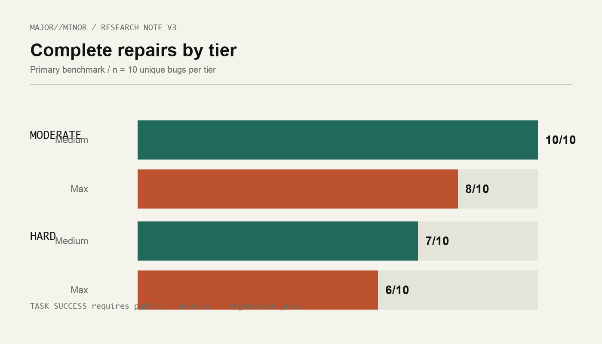
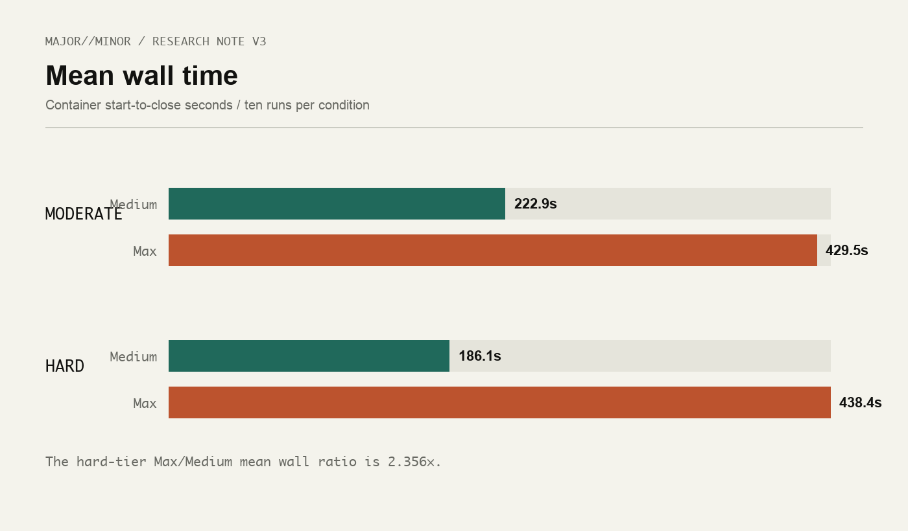
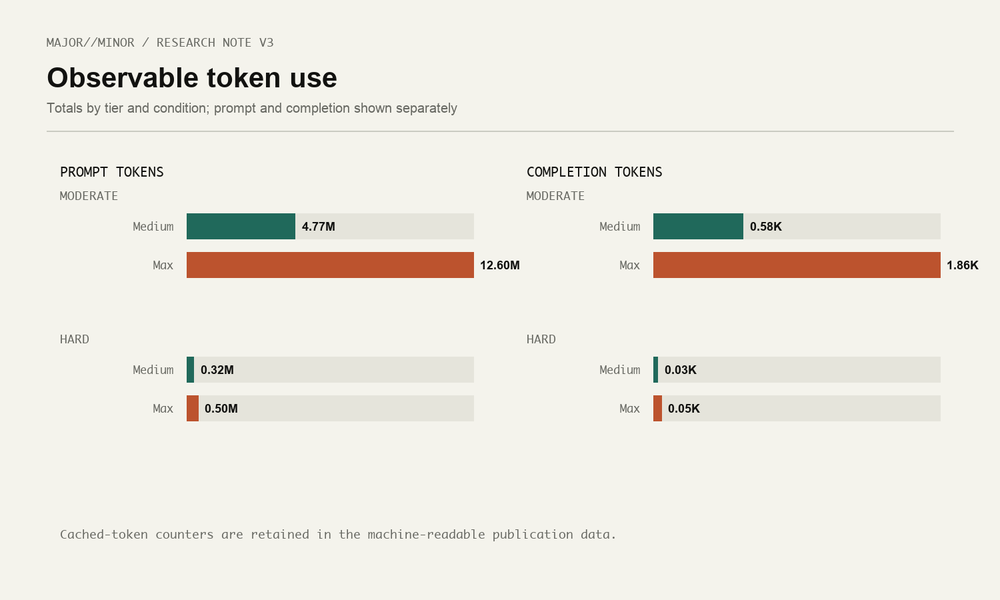
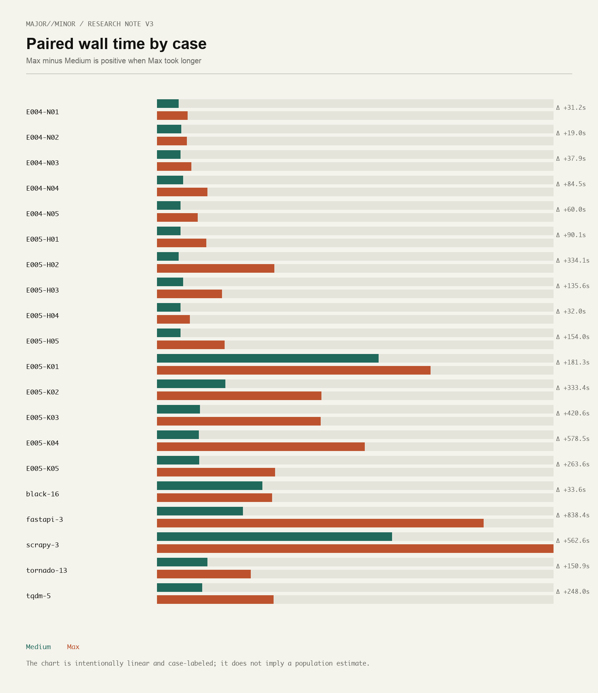

# Reasoning Effort Across Moderate and Hard Repair Tasks

## Abstract

We extended a paired Devin + SWE-2 software-repair benchmark from one moderate task set into a balanced two-tier study. The primary benchmark contains 20 unique bugs and 40 valid runs: ten moderate bugs from E002 historical/public and E004 newly constructed/withheld sets, plus ten hard bugs from E005 split evenly between historical/public and newly constructed/withheld provenance. Every bug was run once with SWE-2 Medium and once with SWE-2 Max under a frozen prompt, fresh workspace, isolated execution boundary, and zero substantive intervention.

Across the primary benchmark, Medium completed 17/20 repairs and Max completed 14/20. The moderate tier was 10/10 versus 8/10; the hard tier was 7/10 versus 6/10. Across the primary benchmark, Max used more observable work: mean wall time was 433.934 seconds versus Medium's 204.466, a 2.122× ratio. On the hard tier specifically, the mean wall-time ratio was 2.356×. The hard-tier pairs were mixed: 5 both-success, 2 Medium-only, 1 Max-only, and 2 both-fail.

This is descriptive evidence from one agent product, one model family, and 20 paired cases. It does not establish that Medium is generally superior, that Max is generally inefficient, or that additional reasoning causes any outcome.

## Research questions

1. What happens to paired repair success as the same benchmark program moves from a balanced moderate tier to a balanced hard tier?
2. Does higher SWE-2 reasoning effort produce a consistent correctness advantage when each condition receives the same task and prompt?
3. How do the conditions differ in observable work: wall time, steps, tool calls, token counters, patch size, and workspace churn?
4. Does case provenance change the descriptive pattern between historical/public and newly constructed/withheld tasks?

## Why a balanced known/withheld design

Historical software defects are valuable because they are realistic and inspectable, but public histories create a question about prior exposure. Newly constructed defects address that question at the level this benchmark can support: the cases, prompts, reference fixes, and held-out tests were withheld from the agent until execution. That does not prove absence from training data. The design therefore controls provenance as an observable property while avoiding an unsupported claim about model memory.

Each primary tier has five historical/public cases and five newly constructed/withheld cases. Every case is paired across Medium and Max. A tier score is the number of runs whose public test, evaluator-side held-out behavior test, and regression suite all pass. E003 is retained as a supplemental easier withheld experiment, not folded into the primary denominator.

## System under test

The system under test was Cognition's Devin operating with SWE-2 Medium or SWE-2 Max. Fusion was excluded. Runs used frozen prompts, fresh sanitized workspaces, no retries, and zero substantive human assistance. Evaluator access began only after the agent session closed. The evaluator recorded public, held-out, and regression outcomes, final patches, source versus workspace changes, observable steps and tool calls, prompt/completion/cached token counters when exposed, timing, termination, and intervention count.

The execution boundary used the completed benchmark protocol: disposable Linux/arm64 containers, dangerous permission mode with effective Bypass inside the container, read-only root, dropped capabilities, no-new-privileges, no Docker socket, no control-repository/evaluator/reference mounts, restricted egress, and bounded resources. E005's exact image, network, proxy, limits, freeze hashes, and complete sanitized evidence are recorded in its [results report](https://github.com/MAJORminorStudio/devin-agent-benchmark/blob/v3.0.0/reports/experiment-005-results.md) and [run artifacts](https://github.com/MAJORminorStudio/devin-agent-benchmark/tree/v3.0.0/artifacts/experiment-005/).

## Experimental lineage

E001 is methodological provenance, not a capability result. Its noninteractive permission-gating failure rejected required tool calls and left empty patches. E002 corrected the execution boundary and supplied the historical moderate set. E003 supplied five easier newly constructed/withheld pairs and produced a 5/5 tie for both conditions. E004 added five newly constructed/withheld cases calibrated against the moderate benchmark; it produced 5/5 for Medium and 4/5 for Max. E005 added the balanced hard tier: five historical/public and five newly constructed/withheld cases, each paired across the two conditions.

The primary benchmark uses E002 + E004 for moderate and E005 for hard. It does not count E003's five unique cases in the 20-bug primary denominator, and it does not count E001 outcomes as capability evidence.

## Primary benchmark design

| Tier | Historical/public | Newly constructed/withheld | Unique bugs | Valid runs |
|---|---:|---:|---:|---:|
| Moderate (E002 + E004) | 5 | 5 | 10 | 20 |
| Hard (E005) | 5 | 5 | 10 | 20 |
| Primary total | 10 | 10 | 20 | 40 |

The 40 primary runs occurred once per condition per case. Prompts were fixed within each pair. Success was behavioral rather than patch-identity based: a semantically different patch could succeed, while a visible-test pass that missed the held-out contract did not.

## Moderate tier

The moderate tier combines E002's five historical/public BugsInPy repairs with E004's five newly constructed/withheld cases. Medium completed 10/10 and Max completed 8/10. E002 produced 5/5 for Medium and 4/5 for Max. E004 produced 5/5 for Medium and 4/5 for Max. The combined moderate tier therefore has eight both-success pairs and two Medium-only pairs, with no Max-only or both-fail pairs.

The moderate tier is useful as a baseline, but it is not a claim that these two five-case sets are perfectly difficulty-equivalent. E002 uses mature public repositories; E004 uses compact newly constructed projects. Their outcome pattern is similar while raw workload differs.

## Hard tier

E005 was designed as a balanced hard tier with five historical/public cases (K01–K05) and five newly constructed/withheld cases (H01–H05). Medium completed 7/10 and Max completed 6/10. The historical split was 4/5 for each condition. The withheld split was 3/5 for Medium and 2/5 for Max.

The hard-tier pair classification is the important shape: five both-success pairs, two Medium-only pairs, one Max-only pair, and two both-fail pairs. Max uniquely solved K04. Medium uniquely solved K02 and H03. H02 and H05 defeated both conditions. This is not a simple Medium-wins story; it is a mixed set in which extra effort changed some trajectories without producing a consistent aggregate correctness advantage.

## Historical versus withheld comparison

| Tier and provenance | Medium | Max |
|---|---:|---:|
| Moderate historical/public (E002) | 5/5 | 4/5 |
| Moderate newly constructed/withheld (E004) | 5/5 | 4/5 |
| Hard historical/public (E005 K) | 4/5 | 4/5 |
| Hard newly constructed/withheld (E005 H) | 3/5 | 2/5 |

The descriptive association is that the hard withheld set was more discriminating than the earlier easier withheld set, and hard outcomes were lower than moderate outcomes for both conditions. It is not evidence that provenance caused the scores or that historical cases were present in training data.

## Paired outcomes

| Tier | Both success | Medium-only | Max-only | Both fail |
|---|---:|---:|---:|---:|
| Moderate | 8 | 2 | 0 | 0 |
| Hard | 5 | 2 | 1 | 2 |
| Primary total | 13 | 4 | 1 | 2 |

The [paired publication CSV](https://github.com/MAJORminorStudio/devin-agent-benchmark/blob/v3.0.0/results/publication-v3-paired-results.csv) makes each classification auditable. The hard tier added a Max-only repair, two Medium-only repairs, and two cases that neither condition completed. This pattern suggests that effort level can change repair trajectories in case-specific ways. It does not support a general ranking.

## Resource use

| Tier / condition | Success | Mean wall s | Steps | Tools | Prompt tokens | Completion tokens | Cached tokens |
|---|---:|---:|---:|---:|---:|---:|---:|
| Moderate / Medium | 10/10 | 222.880 | 280 | 230 | 4773353 | 58202 | 4557005 |
| Moderate / Max | 8/10 | 429.483 | 362 | 437 | 12598295 | 185635 | 12200427 |
| Hard / Medium | 7/10 | 186.052 | 280 | 293 | 319031 | 2871 | 310943 |
| Hard / Max | 6/10 | 438.385 | 381 | 398 | 498938 | 5348 | 481869 |
| Primary / Medium | 17/20 | 204.466 | 560 | 523 | 5092384 | 61073 | 4867948 |
| Primary / Max | 14/20 | 433.934 | 743 | 835 | 13097233 | 190983 | 12682296 |

On E005, Max's mean wall time was 2.356× Medium's. It used more wall time in all ten pairs, at least as many steps in all ten, more steps in nine, more tools in nine, and more prompt and completion tokens in every pair. These are interface and provider observables, not hidden reasoning measures. Cost and ACU counters were unavailable.

## Behavioral held-out failures

The failed hard-tier runs were evaluator-observed behavioral misses:

- H02 Medium and Max marked cancellation terminal but did not retain `CancelledError` as job error provenance.
- H03 Max's oversized-frame recovery skipped the following valid frame when declared payload bytes were absent; its public and held-out checks passed but regression failed.
- H05 Medium and Max skipped a subscription closed during active dispatch instead of keeping it effective for the current stable dispatch.
- K02 Max added a scheduler parameter and prune call but did not enable pruning in the local scheduler factory.
- K04 Medium moved cleanup into `RequestHandler.finish`, clearing template state before an ordinary WebSocket render; Max uniquely completed the case.

There were no timeouts, retries, evaluator-process errors, or infrastructure incidents. Every E005 container terminated as completed, every evaluator status was `OK`, and every leak audit passed.

## What additional effort did and did not show

Max's extra observable work sometimes helped: K04 is a Max-only repair. It also sometimes failed where Medium succeeded: K02 and H03 are Medium-only. In the complete primary benchmark, the aggregate scores were 17/20 for Medium and 14/20 for Max, but the hard-tier pair pattern prevents that difference from being summarized as a universal winner. Two hard cases defeated both conditions.

The supported interpretation is narrower. Higher effort produced more observable work and different trajectories. Additional effort sometimes helped on an individual case. It did not produce a consistent aggregate success improvement in this benchmark. The hard tier produced more failures and more discrimination than the moderate tier, which is evidence that the task design was more challenging in this sample.

## Supplemental E003

E003 remains useful context: five easier newly constructed/withheld pairs, all successful for both conditions (5/5 versus 5/5). It is not part of the primary 20-bug denominator. Including it would mix a supplemental easier replication with the balanced moderate + hard benchmark and would obscure the intended tier structure.

## Limitations

This is an exploratory benchmark with 20 unique primary bugs and one run per condition per bug. It covers one agent product, one model family, one prompt protocol, and heterogeneous repositories. The sample does not support statistical significance testing, universal capability claims, or causal attribution. Steps, tool calls, tokens, wall time, patches, and filesystem changes are observable activity measures; they do not reveal internal reasoning. Historical/public and newly constructed/withheld labels describe benchmark provenance and withholding, not model training exposure. Public release after execution also changes the future information boundary.

## Reproducibility and public evidence

The canonical machine-readable package is the [V3 summary](https://github.com/MAJORminorStudio/devin-agent-benchmark/blob/v3.0.0/results/publication-v3-summary.json), the [40-run CSV](https://github.com/MAJORminorStudio/devin-agent-benchmark/blob/v3.0.0/results/publication-v3-runs.csv), and the [20-pair CSV](https://github.com/MAJORminorStudio/devin-agent-benchmark/blob/v3.0.0/results/publication-v3-paired-results.csv). Sanitized evidence is available for [E002](https://github.com/MAJORminorStudio/devin-agent-benchmark/tree/v3.0.0/artifacts/experiment-002), [E004](https://github.com/MAJORminorStudio/devin-agent-benchmark/tree/v3.0.0/artifacts/experiment-004), and [E005](https://github.com/MAJORminorStudio/devin-agent-benchmark/tree/v3.0.0/artifacts/experiment-005). Methodology and reproduction instructions are in the [E005 protocol](https://github.com/MAJORminorStudio/devin-agent-benchmark/blob/v3.0.0/docs/experiment-005-protocol.md) and the [experiment reports](https://github.com/MAJORminorStudio/devin-agent-benchmark/tree/v3.0.0/reports). The [E001 methodological record](https://github.com/MAJORminorStudio/devin-agent-benchmark/blob/v3.0.0/reports/experiment-001-results.md) and [supplemental E003 report](https://github.com/MAJORminorStudio/devin-agent-benchmark/blob/v3.0.0/reports/experiment-003-results.md) remain available without being counted in the primary denominator.

## Conclusion

We made the benchmark harder while keeping the primary design balanced across historical/public and newly constructed/withheld provenance. Medium completed 17/20 primary repairs; Max completed 14/20. The moderate tier was 10/10 versus 8/10, and the hard tier was 7/10 versus 6/10. Max consistently used more observable resources on the hard tier, but the paired results were mixed: one Max-only repair, two Medium-only repairs, and two both-fail cases. The result became more nuanced as difficulty increased. It motivates a future very-hard capability-frontier tier, but it does not announce or measure that experiment.

The complete machine-readable publication is [`results/publication-v3-summary.json`](../results/publication-v3-summary.json); all chart files are in [`assets/charts-v3/`](../assets/charts-v3/).
