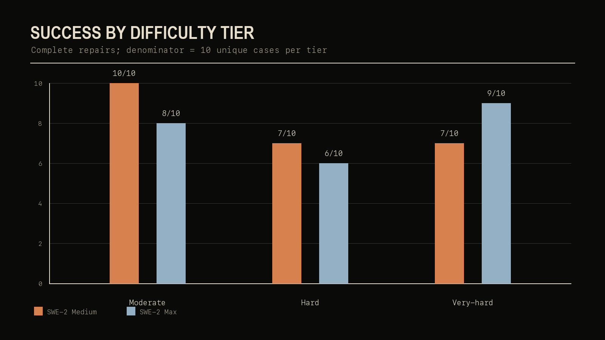
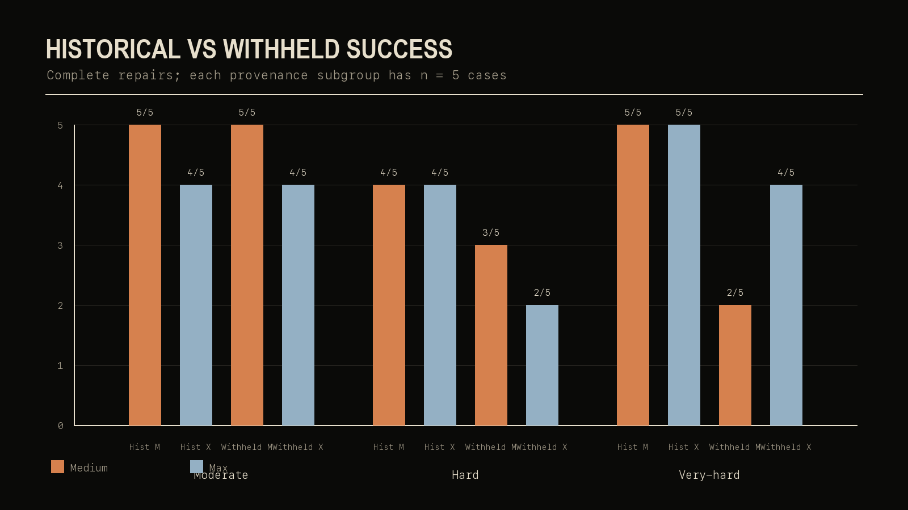
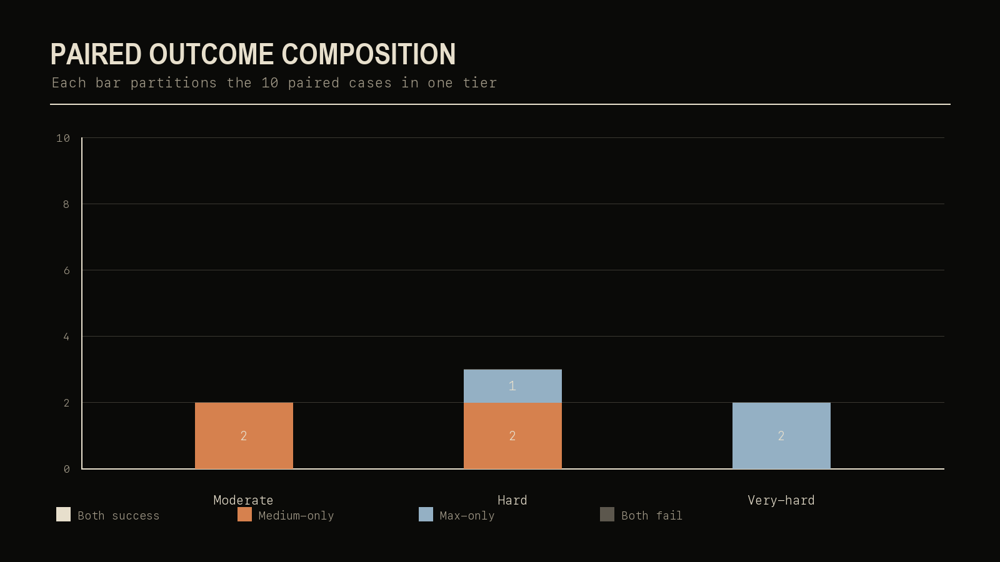
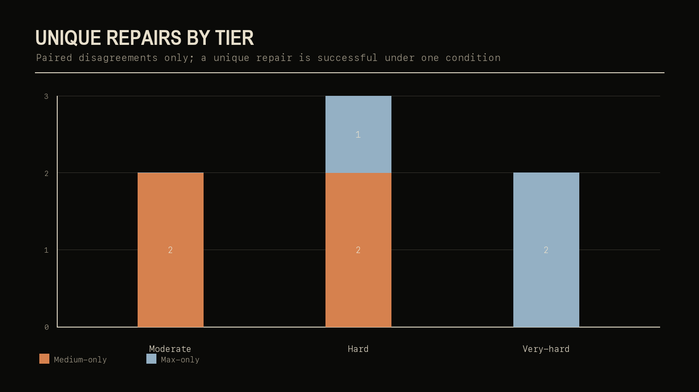
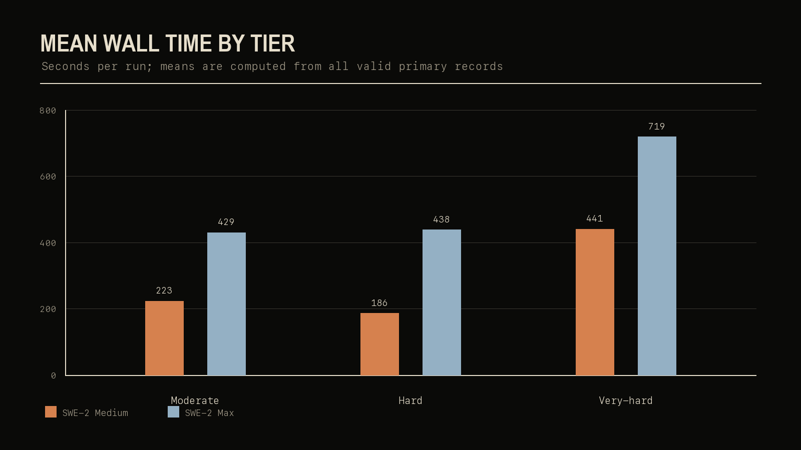
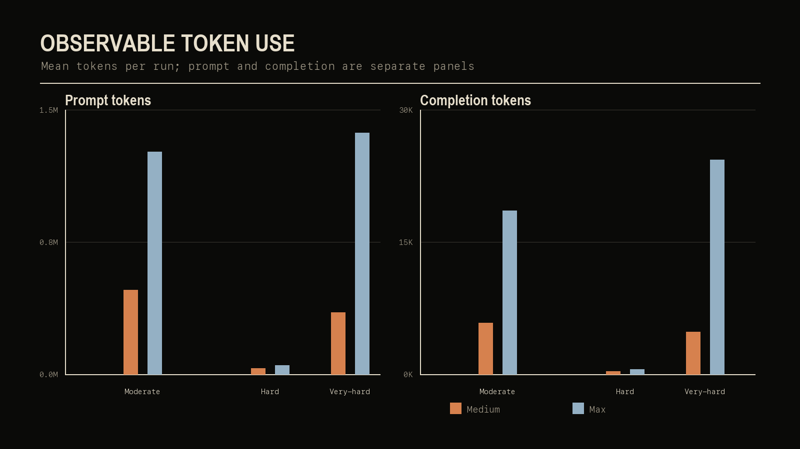
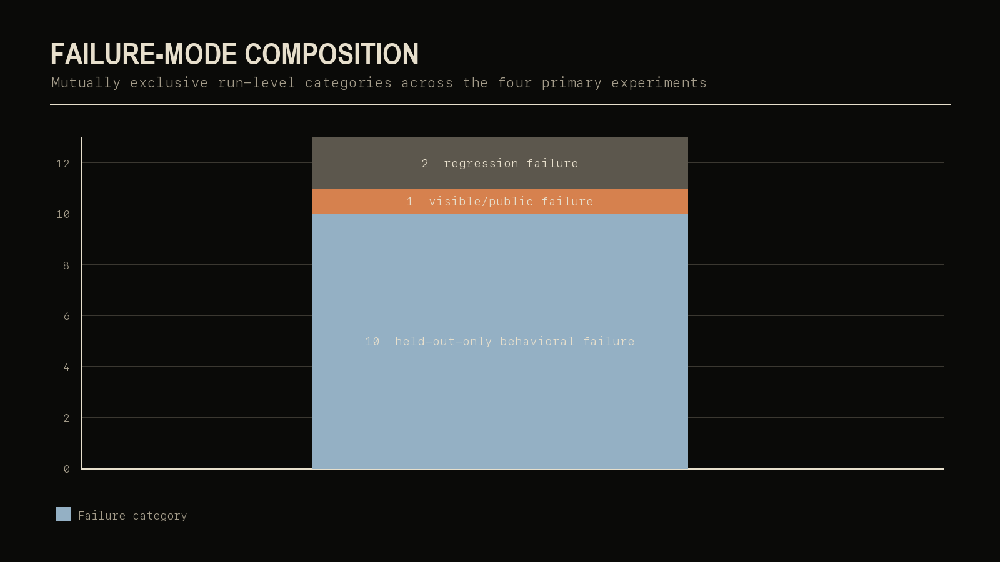
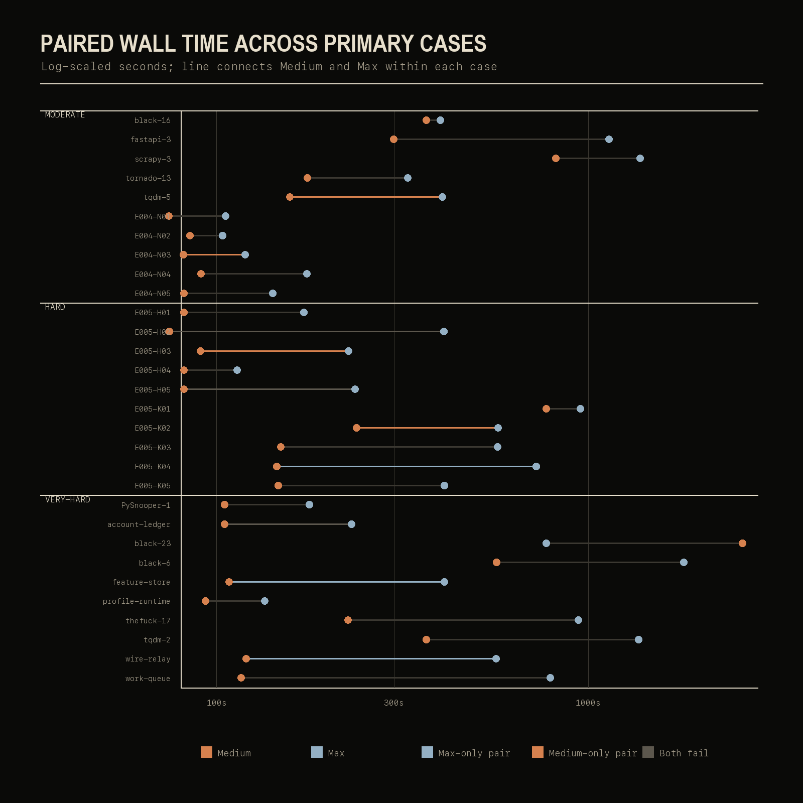
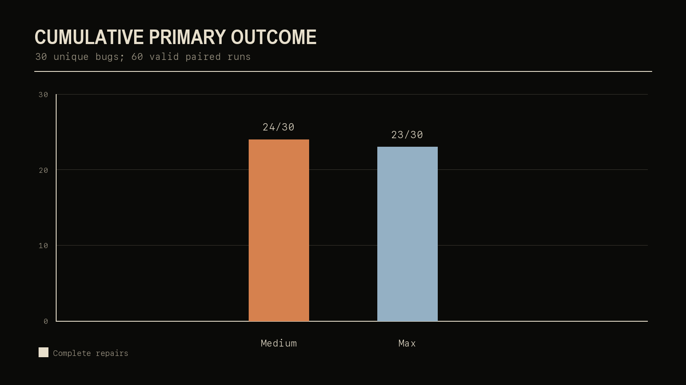

# Reasoning Effort Across the Software-Repair Difficulty Curve

## A 30-case paired evaluation of SWE-2 Medium and Max in Devin

**Publication version:** 4.0.0
**Canonical evidence commit:** `82915fc31c63cd8fb6a01a4e527be95e0d7de698`
**Study status:** final synthesis of the completed E001–E006 program

## 1. Abstract

This report evaluates how SWE-2 reasoning effort relates to autonomous software-repair success and observable resource use as task difficulty increases. The primary benchmark contains 30 unique defects and 60 valid runs: each defect was run once with SWE-2 Medium and once with SWE-2 Max, using identical paired prompts, fresh sanitized workspaces, hidden evaluator tests, and no substantive intervention. The 30 cases are divided into three balanced tiers. Each tier contains five historical/public defects and five newly constructed/withheld defects.

The aggregate result is nearly tied: Medium completed 24/30 repairs and Max completed 23/30. The tier pattern is more informative than the total. On moderate cases, Medium scored 10/10 versus Max at 8/10. On hard cases, Medium scored 7/10 versus Max at 6/10. On very-hard cases, the relationship reversed: Medium scored 7/10 and Max 9/10. The very-hard tier produced seven pairs in which both conditions succeeded, two Max-only repairs, no Medium-only repairs, and one pair in which both failed.

Max consistently performed more observable work, including more wall time, steps, tool calls, and token use. At very-hard difficulty its mean wall time was 1.63× Medium's, while mean prompt tokens were 3.92×, completion tokens 5.07×, and cached tokens 4.27×. The data therefore support a cautious interaction hypothesis: additional reasoning effort changed repair trajectories, but its correctness benefit was not uniform and appeared in the unique-win pattern only at the frontier tier. This is a small, exploratory, non-causal study. It measures observable activity, not hidden reasoning, and it does not establish general superiority, a universal crossover point, or any conclusion about training exposure.

## 2. Research question

The final question is:

> How does SWE-2 reasoning effort relate to autonomous software-repair success and resource use as task difficulty increases?

The design treats reasoning effort, task difficulty, repair success, case provenance, observable resource use, and paired outcomes as linked dimensions. The central comparison is not a single leaderboard total. It is whether the relationship between Medium and Max changes as the benchmark moves from moderate to hard to very-hard repairs.

## 3. Experimental lineage

The completed program has six experiments with different evidentiary roles:

| Experiment | Contribution | Final role |
|---|---|---|
| E001 | Exposed a noninteractive permission-gating failure in the original unattended setup. | Methodological provenance only. |
| E002 | Re-ran five historical/public BugsInPy cases after correcting the execution boundary. | Moderate historical/public tier. |
| E003 | Added five easier newly constructed/withheld cases. | Supplemental replication, excluded from the primary denominator. |
| E004 | Added five newly constructed/withheld moderate cases. | Moderate withheld tier. |
| E005 | Added ten hard cases, balanced across historical/public and withheld provenance. | Hard tier. |
| E006 | Added ten frozen very-hard cases, balanced across the same provenance split. | Very-hard tier. |

E001 is preserved because the effective permission policy is part of an autonomous-agent protocol, but its empty patches and rejected tool calls are not capability evidence. E003 remains useful as easier withheld replication evidence: Medium and Max both scored 5/5, but it is not included in the 30-case primary denominator.

## 4. System under test

The system under test is Cognition's Devin agent using the SWE-2 Medium and SWE-2 Max conditions. The benchmark compares the conditions as deployed in the frozen runs; it does not attempt to isolate or measure private chain-of-thought, hidden deliberation, or an abstract reasoning token budget. “More reasoning” in this report means the condition associated with the Max run and its resulting observable activity.

Each run began from a fresh sanitized workspace containing the buggy project state. The reference fix and held-out target tests remained evaluator-side. The agent received the frozen task prompt for its pair, could inspect and modify the workspace, and was not given substantive help. Sessions were closed before independent evaluation.

## 5. Balanced benchmark design

The primary design has 30 unique bugs, 60 valid runs, three tiers, and 30 complete Medium/Max pairs:

| Tier | Canonical experiments | Cases | Runs | Historical/public | Withheld | Medium | Max |
|---|---|---:|---:|---:|---:|---:|---:|
| Moderate | E002 + E004 | 10 | 20 | 5 | 5 | 10/10 | 8/10 |
| Hard | E005 | 10 | 20 | 5 | 5 | 7/10 | 6/10 |
| Very-hard | E006 | 10 | 20 | 5 | 5 | 7/10 | 9/10 |
| **Primary total** | **E002/E004/E005/E006** | **30** | **60** | **15** | **15** | **24/30** | **23/30** |

Every primary case appears exactly once under each condition. The aggregate totals are nearly tied, but the paired relationship changes with difficulty: earlier tiers contain Medium-only outcomes, while the very-hard tier contains Max-only outcomes and no Medium-only outcomes.

## 6. Difficulty-tier construction and calibration

The tiers were defined before this final synthesis from task-selection and protocol decisions, not retroactively from the final scores. E002 and E004 form the moderate tier; E005 is the hard tier; E006 is the very-hard tier. The tier labels are therefore study design labels, not claims that the cases define a universal software difficulty scale.

The realized data give partial calibration. The hard tier had the lowest aggregate success, with 13/20 successful runs and three discordant pairs plus two both-fail pairs. The very-hard tier elicited the deepest Max activity and one both-fail pair, yet Max achieved its highest tier score at 9/10. This matters: solve rate alone is not sufficient to define realized difficulty. A tier can demand deeper work or produce a different capability regime even when one condition solves more cases.

## 7. Historical/public versus newly constructed/withheld provenance

Historical/public cases may have been represented in public model-training corpora, while the newly constructed benchmark instances were withheld before execution. That distinction is a provenance description, not a claim about training contamination or its absence.

The success split is descriptive:

| Tier / provenance | Medium | Max |
|---|---:|---:|
| Moderate historical/public (E002) | 5/5 | 4/5 |
| Moderate newly constructed/withheld (E004) | 5/5 | 4/5 |
| Hard historical/public (E005) | 4/5 | 4/5 |
| Hard newly constructed/withheld (E005) | 3/5 | 2/5 |
| Very-hard historical/public (E006) | 5/5 | 5/5 |
| Very-hard newly constructed/withheld (E006) | 2/5 | 4/5 |

The largest provenance contrast is in very-hard cases: both conditions solved all five historical/public cases, while Max solved four withheld cases and Medium solved two. In hard cases, both conditions did better on historical/public cases than withheld cases. These patterns motivate contamination-aware replication, but they do not diagnose why a particular case was solved.

## 8. Evaluation methodology

TASK_SUCCESS required the public tests, held-out target tests, and a clean regression suite to pass. A visible public pass with a held-out failure was therefore an unsuccessful repair. The evaluator also recorded evaluation status, wall time, steps, tool calls, token metrics, source-patch breadth, workspace churn, and line counts.

The final E006 execution followed its frozen 20-run order exactly once per run. The evaluator reported no in-protocol evaluator incidents and no timeouts across the 60 primary runs. A pre-invocation E006 launcher-staging incident was handled before any Devin start and is not included as a benchmark run or as a capability failure.

## 9. Moderate results

Medium completed all ten moderate cases. Max completed eight. The paired result was eight both-success pairs and two Medium-only pairs; there were no Max-only or both-fail pairs.

Medium's mean wall time was 222.9 seconds, compared with 429.5 seconds for Max. Mean observable steps were 28.0 versus 36.2 and mean tool calls were 23.0 versus 43.7. Mean prompt tokens were 477,335 for Medium and 1,259,830 for Max; mean completion tokens were 5,820 and 18,564, respectively. The moderate result is not evidence that lower effort is generally preferable. It is a paired observation that the extra observable activity did not yield a unique Max repair in these ten cases.

## 10. Hard results

Medium completed seven hard cases and Max completed six. The ten pairs contained five both-success outcomes, two Medium-only outcomes, one Max-only outcome, and two both-fail outcomes.

Max again consumed more observable resources: mean wall time was 438.4 seconds versus 186.1 seconds, mean steps were 38.1 versus 28.0, and mean tool calls were 39.8 versus 29.3. Mean prompt tokens were 49,894 versus 31,903, and mean completion tokens were 535 versus 287. The hard tier thus continued the pattern of higher Max activity without an aggregate success advantage.

## 11. Very-hard results

The very-hard tier changes the paired story. Medium completed seven cases and Max completed nine. Seven pairs succeeded under both conditions; two were Max-only; none were Medium-only; and one defeated both conditions. This is the only primary tier with a positive Max-only-minus-Medium-only balance.

The five historical/public E006 cases were `black-23`, `tqdm-2`, `thefuck-17`, `PySnooper-1`, and `black-6`. The five newly constructed/withheld cases were `work-queue`, `wire-relay`, `feature-store`, `profile-runtime`, and `account-ledger`. The historical/public split was 5/5 for both conditions. On withheld cases, Medium scored 2/5 and Max 4/5.

Mean wall time was 440.7 seconds for Medium and 719.0 seconds for Max. Max's means were also higher for steps (36.0 versus 22.3), tool calls (36.9 versus 20.8), prompt tokens (1,368,398 versus 349,072), completion tokens (24,290 versus 4,790), and cached tokens (1,316,382 versus 307,957).

## 12. Cross-tier paired outcomes

Across all 30 pairs, 20 were both-success, four were Medium-only, three were Max-only, and three were both-fail. Thus the cumulative run totals favor Medium by one, while the unique-repair balance favors Medium by one overall. The direction is not stable across tiers: Medium-only outcomes appear in moderate and hard tiers; Max-only outcomes appear in hard and very-hard tiers; the very-hard tier has two Max-only outcomes and no Medium-only outcomes.

## 13. Resource-use synthesis

The following table reports per-condition means across each tier. “Churn” is workspace files changed; source breadth is source files changed. Token counts are observable prompt, completion, and cached-token fields from the canonical ledgers.

| Tier | Condition | Mean wall (s) | Median wall (s) | Mean steps | Mean tools | Prompt tokens | Completion tokens | Cached tokens | Source files | Churn files |
|---|---|---:|---:|---:|---:|---:|---:|---:|---:|---:|
| Moderate | Medium | 222.9 | 124.0 | 28.0 | 23.0 | 477,335 | 5,820 | 455,701 | 1.0 | 9.0 |
| Moderate | Max | 429.5 | 250.8 | 36.2 | 43.7 | 1,259,830 | 18,564 | 1,220,043 | 1.0 | 322.8 |
| Hard | Medium | 186.1 | 117.7 | 28.0 | 29.3 | 31,903 | 287 | 31,094 | 1.9 | 1.9 |
| Hard | Max | 438.4 | 409.5 | 38.1 | 39.8 | 49,894 | 535 | 48,187 | 2.0 | 2.0 |
| Very-hard | Medium | 440.7 | 118.2 | 22.3 | 20.8 | 349,072 | 4,790 | 307,957 | 2.2 | 30.7 |
| Very-hard | Max | 719.0 | 667.7 | 36.0 | 36.9 | 1,368,398 | 24,290 | 1,316,382 | 2.2 | 31.1 |

At very-hard difficulty, the Max/Medium mean ratios were 1.63× wall time, 1.61× steps, 1.77× tool calls, 3.92× prompt tokens, 5.07× completion tokens, and 4.27× cached tokens. The additional effort was associated with two unique Max repairs in that tier, while earlier tiers had no Max-only moderate repair and only one Max-only hard repair. Descriptively, the additional expenditure became more productive at the very-hard tier in terms of unique paired successes. This is not a cost-effectiveness estimate: no pricing or ACU accounting was available, and means are sensitive to long runs.

## 14. Behavioral held-out failures

The independent held-out evaluator detected incomplete repairs that visible tests alone would have counted as successes. Across the four primary experiments, there were ten mutually exclusive held-out-only behavioral failures, two regression failures, and one visible/public failure. There were no timeouts and no in-protocol evaluator incidents.

Held-out-only failures occurred once in E002, once in E004, five times in E005, and three times in E006. In total, ten primary runs passed public tests but failed held-out tests. E005 also contained one regression failure and one public failure; E006 contained one regression failure. These counts show why a public-test-only benchmark would overstate repair success and obscure the failure modes that become common in the harder tiers.

## 15. Difficulty and behavioral complexity

The primary tiers differ in both outcomes and activity. Moderate cases generated the strongest Medium score and the largest moderate Max workspace-churn mean, driven by observable generated/environment changes in some Max runs. Hard cases had the lowest aggregate success and the most balanced mixture of unique and both-fail outcomes. Very-hard cases elicited the largest Max token means and the largest Max/Medium token ratios, plus the only clear Max-only advantage by tier.

The result should not be summarized as “very-hard was easier.” Very-hard Max solved more cases, but its runs used more steps, tools, wall time, and tokens, and its paired pattern differed qualitatively. The tier labels capture a designed progression in case selection and task demands; realized difficulty is multidimensional and condition-dependent.

## 16. Exploratory statistics

The paired analysis uses an exact two-sided conditional McNemar/binomial test on discordant outcomes. Wilson intervals summarize each condition's success proportion. These are exploratory summaries for small paired samples, not confirmatory evidence.

| Set | Medium-only | Max-only | Exact two-sided p | Medium 95% Wilson interval | Max 95% Wilson interval |
|---|---:|---:|---:|---:|---:|
| Moderate (10 pairs) | 2 | 0 | 0.500 | 0.722–1.000 | 0.490–0.943 |
| Hard (10 pairs) | 2 | 1 | 1.000 | 0.397–0.892 | 0.313–0.832 |
| Very-hard (10 pairs) | 0 | 2 | 0.500 | 0.397–0.892 | 0.596–0.982 |
| Primary cumulative (30 pairs) | 4 | 3 | 1.000 | 0.627–0.905 | 0.591–0.882 |

The sample is underpowered for precise tier-specific inference. The intervals overlap, all exact paired p-values are non-significant at conventional thresholds, and no causal model of reasoning effort was fit. The statistics are useful for expressing uncertainty and preserving the pair structure, not for manufacturing a winner.

## 17. What changed at the frontier

Three observations are most important. First, aggregate success did not move monotonically with the nominal effort condition: Medium led on moderate and hard totals, while Max led on very-hard. Second, the paired composition changed: earlier tiers included Medium-only repairs, but E006 produced two Max-only repairs and zero Medium-only repairs. Third, Max's additional observable effort was largest at the very-hard tier, where it coincided with those unique repairs.

The strongest supported interpretation is conditional: more reasoning effort changed repair trajectories, but additional effort did not provide a uniform correctness benefit. In this benchmark, the unique-repair advantage of Max appeared at the very-hard frontier. This is evidence for an interaction worth testing in larger studies, not proof of a universal crossover point or a general claim that Max is better on very-hard software tasks.

## 18. Limitations

The primary sample has ten cases per tier and one run per condition per case. It spans one agent product, one model family, one protocol, and primarily Python software-repair tasks. The tier labels are not a universal scale. Stochastic variation, case selection, prompt effects, and environment effects remain possible.

The study measures observable wall time, steps, tools, tokens, and file changes. It does not measure hidden reasoning quality or private deliberation. Resource means can be skewed by long sessions, and no cost or ACU data were available. Historical/public exposure cannot be ruled out, while withheld provenance does not prove absence from training data. The evaluator's held-out tests strengthen behavioral validity but remain a finite operationalization of each task's contract.

Accordingly, the results do not establish that Max is generally better on difficult tasks, that Medium is generally better on moderate tasks, that more reasoning causes better frontier performance, or that the observed pattern will generalize to other agents, languages, versions, or task distributions.

## 19. Reproducibility and evidence boundary

The machine-readable final outputs are generated by [`scripts/build_publication_v4.py`](../scripts/build_publication_v4.py) from the canonical E002, E004, E005, and E006 summaries/ledgers. The generator performs the case, pair, tier, and provenance assertions before writing the publication outputs. It does not invoke Devin or SWE-2.

Publication derivatives:

- [`results/publication-v4-summary.json`](../results/publication-v4-summary.json)
- [`results/publication-v4-paired-results.csv`](../results/publication-v4-paired-results.csv)
- [`results/publication-v4-runs.csv`](../results/publication-v4-runs.csv)
- [`results/publication-v4-tier-summary.csv`](../results/publication-v4-tier-summary.csv)
- [`artifacts/publication-v4/README.md`](../artifacts/publication-v4/README.md)

The chart manifest records SHA-256 hashes for all nine PNG charts. The immutable historical release tags v1.0.0, v2.0.0, and v3.0.0 remain unchanged. No E001–E006 canonical prompts, evaluators, results, or frozen manifests are modified by this publication layer.

## 20. Conclusion

The final primary benchmark is a near tie in aggregate repair success: Medium 24/30 and Max 23/30. That total conceals a tier-dependent relationship. Medium led on moderate and hard cases, while Max led 9/10 to 7/10 on very-hard cases and produced two Max-only repairs with no Medium-only repairs. Max also performed substantially more observable work, especially in tokens, at the frontier.

The defensible conclusion is therefore about conditional value, not a universal winner: within this completed benchmark, increased reasoning effort became more useful for unique repair success at the very-hard tier, but did not improve aggregate correctness uniformly across the difficulty curve. The result is strong enough to motivate replication and weak enough that replication is necessary.

## 21. Future work

The planned experimental phase is complete. Future, separately authorized studies could replicate the paired design with another coding agent or model family, add languages, increase the number of cases, repeat stochastic runs per case, normalize outcomes by cost, evaluate a supported High-effort condition, study Fusion as a separate system-level intervention, or test newer SWE-2 versions and models. None of those studies is part of this publication, and no E007 is created here.
