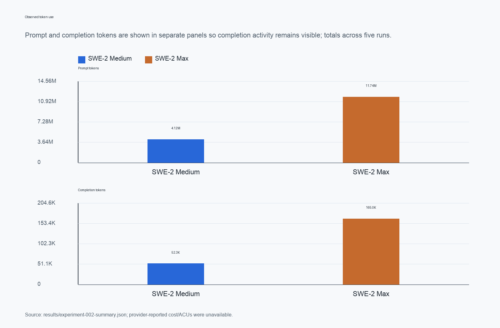
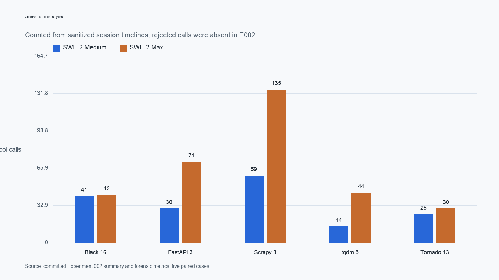
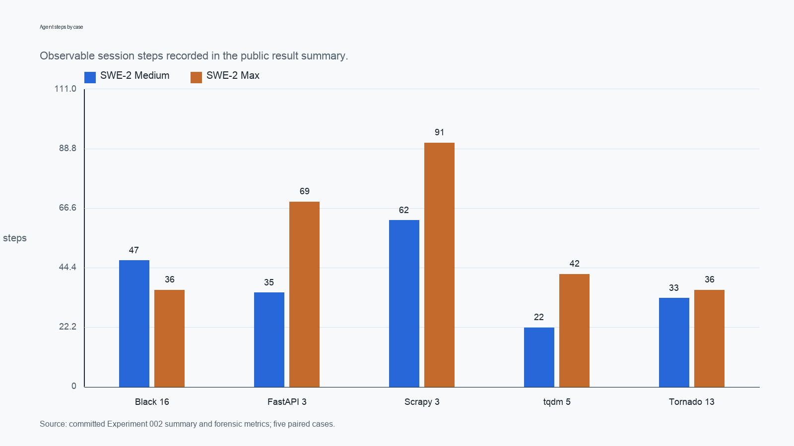
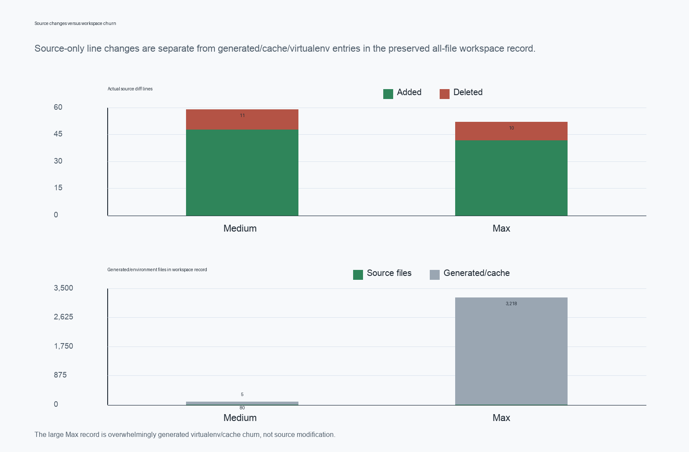

# Devin + SWE-2 Reasoning Effort Benchmark: A Five-Case Paired Pilot

**Public research report · publication version 1.0.0 · 2026-09-15**

This report is the public-facing account of the completed Experiment 001 and
Experiment 002 work in the
[MAJORminorStudio/devin-agent-benchmark](https://github.com/MAJORminorStudio/devin-agent-benchmark)
repository. It is written as an independent technical evaluation of an
agent configuration, not as a marketing claim about Cognition or Devin.

## Abstract

We evaluated Cognition's Devin agent on five real Python software bugs drawn
from BugsInPy, comparing SWE-2 Medium with SWE-2 Max under a frozen paired
protocol. Each condition received the same task prompt for a case, started
from a fresh sanitized workspace containing the buggy revision, and received
no substantive human assistance or retries. After the Devin session closed,
an evaluator ran the public regression, evaluator-only held-out behavior
tests, and a practical regression subset. Behavioral `TASK_SUCCESS` required
all three checks to pass.

In Experiment 002, Medium solved 5/5 cases and Max solved 4/5. Medium's total
wall time was 1,816.309 seconds (mean 363.262; median 299.332), compared with
3,649.780 seconds for Max (mean 729.956; median 405.290). Medium recorded 199
steps, 4.12 million prompt tokens, and 52.3 thousand completion tokens;
Max recorded 274 steps, 11.74 million prompt tokens, and 165.0 thousand
completion tokens. Max used more wall time and more observable tool calls in
all five pairs, but did not improve aggregate repair accuracy. Monetary cost
and ACU data were unavailable.

These results are **observed** in this five-case pilot. They are **suggestive**
of a hypothesis that additional autonomous reasoning effort can add activity
without improving correctness on some bounded repair tasks. They do not
establish that Medium is generally better, that Max is generally inefficient,
or that more reasoning causes worse coding performance. Experiment 001 is not
a capability baseline: its unattended `accept-edits` configuration rejected
required shell actions in all ten runs and produced empty patches. Experiment
002 corrected that permission boundary inside an isolated Docker environment.

## 1. Introduction

Coding-agent evaluations can conflate at least three variables: the model or
effort condition, the task and evaluator, and the operational environment in
which the agent is allowed to work. This project separates those concerns as
far as the small pilot permits. The primary comparison is between two frozen
SWE-2 effort conditions on identical repair cases. The secondary operational
question is whether permission configuration can make an apparently capable
agent unable to perform ordinary repository work.

The benchmark uses historical BugsInPy cases because each case supplies a
buggy state, a known fixed state, project tests, and associated metadata. The
agent sees only the sanitized buggy workspace, the frozen task prompt, and the
tests normally available in that workspace. The human/reference patch and
evaluator-only held-out tests remain outside the agent workspace. This makes
the final behavioral check independent of whether an agent happens to produce
the same textual patch as the historical repair.

The work is intentionally isolated from unrelated lab and production systems.
BugsInPy is an external checkout referenced by a source lock;
the dataset repository is not vendored here.

## 2. Research questions and claim discipline

### Primary question

How did SWE-2 Medium and SWE-2 Max compare when Devin autonomously repaired
five real open-source Python bugs with known ground truth?

### Secondary operational question

How much can autonomous-agent permission configuration affect observed
benchmark performance?

The primary question is answered by Experiment 002. Experiment 001 supplies
an operational finding and is not used as a clean Medium-versus-Max
capability comparison.

### Interpretation levels

**Observed.** Directly demonstrated by the committed five-pair E002 record:
Medium solved 5/5, Max solved 4/5; Max used more wall time in every pair and
more tool calls in every pair; the only correctness disagreement was tqdm-5.

**Suggestive.** The pattern motivates testing whether higher effort can produce
diminishing efficiency returns on bounded software repair, especially when
the task is already within the lower-effort condition's capability range.

**Not established.** This pilot cannot support a general ranking of Devin
conditions, a causal claim that Max is slower or less capable, a claim that
more reasoning makes coding agents worse, statistical significance, a
generalization beyond this task set, or any reconstruction of hidden model
reasoning.

## 3. Experimental design

The five cases were selected and frozen before the Devin runs. They use the
following BugsInPy-backed project revisions:

| Case | Project / bug | Difficulty | Behavioral target |
|---|---|---|---|
| E001-C01 | Black 16 | medium | Ignore an out-of-root Python symlink while continuing in-root discovery |
| E001-C02 | FastAPI 3 | medium-high | Recursively serialize nested response content with aliases and unset-field behavior |
| E001-C03 | Scrapy 3 | medium | Normalize an extra-slash protocol-relative redirect while preserving the request scheme |
| E001-C04 | tqdm 5 | medium | Preserve the inferred length of a sized iterable when display is disabled |
| E001-C05 | Tornado 13 | medium-high | Make the HTTP/1.x keep-alive decision safely for a bodyless response without Content-Length |

The frozen prompts are in [`prompts/experiment-001/`](../prompts/experiment-001/).
The case commits, source lock, expected outcomes, and evaluator policy are in
[`manifests/experiment-001.json`](../manifests/experiment-001.json) and the
E002 configuration in [`manifests/experiment-002-config.json`](../manifests/experiment-002-config.json).

Each pair used the same case and prompt, with the model condition varied
between `swe-2-medium` and `swe-2-max`. The E002 order was the frozen
interleaving:

1. E002-C02-M
2. E002-C04-X
3. E002-C01-M
4. E002-C05-X
5. E002-C03-M
6. E002-C01-X
7. E002-C04-M
8. E002-C02-X
9. E002-C05-M
10. E002-C03-X

No prior-run result, evaluator output, or reference patch was exposed to any
later Devin session. There were no retries and no substantive interventions.

## 4. Agent configuration

Experiment 002 used the frozen local Docker execution path recorded in
[`manifests/experiment-002-config.json`](../manifests/experiment-002-config.json):

- Devin CLI 3000.10.21 (611c1cba).
- SWE-2 Medium or SWE-2 Max, with Fusion excluded.
- A disposable Linux/arm64 container for each run.
- One fresh sanitized benchmark workspace and a fresh output directory.
- Session timeout of 3,600 seconds, one case at a time, and zero retries.
- No paid-charge prompt or charge was observed; cost and ACU fields were
  unavailable in the provider records.

The task prompt and model were checked before each invocation. Session output,
timing, observable tool metadata, workspace changes, patches, and evaluator
results were preserved. The Devin session was closed before evaluator-side
tests and reference comparison.

## 5. Isolation and security

The E002 container was deliberately restrictive around the benchmark boundary:
read-only root filesystem, all Linux capabilities dropped, no-new-privileges,
no Docker socket, no host home or control-repository mount, and no host
repository access. The container exposed only the sanitized workspace, a fresh
artifact directory, one read-only Devin credential file, and an internal
network path through an allowlisted egress proxy. Dependency installation by
the agent was disabled in the frozen configuration.

The `dangerous` runner setting produced effective `Bypass` tool permissions.
That setting was accepted only inside the disposable container because the
agent needed to inspect files, execute shell commands, modify source, and run
tests without interactive confirmation. Permission policy is therefore part
of the effective autonomous-agent system being measured. It should not be
interpreted as permission to run an unrestricted agent on a developer host.

Committed public artifacts are sanitized derivatives. They retain useful
prompts, patches, evaluator outcomes, session summaries, timelines, stdout,
stderr, and hashes, while omitting raw machine-specific workspaces and
credential-bearing or excessive environment records. The public artifact
policy and per-run exclusions are documented in
[`artifacts/experiment-002/README.md`](../artifacts/experiment-002/README.md).

## 6. Evaluation method

After a session closed, the evaluator compared the resulting workspace with
the prepared buggy baseline and captured a unified patch. It then ran:

1. the required public/project regression command(s),
2. evaluator-only held-out tests targeting the reported defect, and
3. the case's practical regression subset.

`TASK_SUCCESS = 1` only when the held-out target tests passed, the required
public tests passed, and no disqualifying regression was detected. An
evaluator infrastructure problem is distinct from an agent failure; it is
recorded as an evaluation error rather than silently converted to a failed
repair.

The held-out tests are in
[`evaluation/experiment-001/`](../evaluation/experiment-001/). Their metadata
and expected behavior were never copied into an agent workspace. The
evaluator uses behavior as the authority: a structurally different repair can
pass, while a patch that passes a visible test but fails the held-out contract
does not count.

## 7. Experiment 001: infrastructure failure

E001 used the same five cases, pair structure, frozen prompts, and model
conditions, but ran the local CLI noninteractively with `accept-edits`. The
CLI still requested confirmation for shell actions. In an unattended process,
those confirmations could not be supplied. The permission-gated tool calls
were rejected across all ten runs, every patch remained empty, and both
conditions scored 0/5.

This is an operational result: the configured system could not carry out the
repository-debugging workflow. It is not evidence that either SWE-2 condition
could not solve the bugs. E001 is retained as provenance in the
[E001 report](experiment-001-results.md) and its
[sanitized public artifacts](../artifacts/experiment-001/README.md).
Experiment 002 corrected only this execution variable by using effective
Bypass within the isolated Docker path. The cases, prompts, order, scoring,
and intervention policy were not changed.

## 8. Experiment 002: results

The complete canonical record is
[`results/experiment-002-summary.json`](../results/experiment-002-summary.json).
The human-readable run ledger is the
[E002 results report](experiment-002-results.md), and the observable forensic
reconciliation is the [E002 forensic analysis](experiment-002-forensic-analysis.md).

| Condition | Success | Total wall (s) | Mean wall (s) | Median wall (s) | Total steps | Tool calls | Prompt tokens | Completion tokens | Source diff |
|---|---:|---:|---:|---:|---:|---:|---:|---:|---:|
| SWE-2 Medium | 5/5 | 1,816.309 | 363.262 | 299.332 | 199 | 169 | 4,120,476 | 52,313 | +48 / -11 |
| SWE-2 Max | 4/5 | 3,649.780 | 729.956 | 405.290 | 274 | 322 | 11,740,951 | 164,983 | +42 / -10 |

The paired outcome counts were: both succeeded = 4, Medium only = 1, Max
only = 0, and both failed = 0. Max used more wall time in 5/5 pairs and more
observable tool calls in 5/5 pairs. Across condition totals, Max used about
2.01× the mean wall time, 1.38× the steps, 2.85× the prompt tokens, and
3.15× the completion tokens. These are descriptive ratios, not significance
tests.



The per-run record is:

| Run | Case | Condition | Success | Public | Held-out | Regression | Wall (s) | Steps | Tool calls |
|---|---|---|---:|---|---|---|---:|---:|---:|
| E002-C02-M | FastAPI 3 | Medium | 1 | pass | pass | clean | 299.332 | 35 | 30 |
| E002-C04-X | tqdm 5 | Max | 0 | pass | fail | clean | 405.290 | 42 | 44 |
| E002-C01-M | Black 16 | Medium | 1 | pass | pass | clean | 366.269 | 47 | 41 |
| E002-C05-X | Tornado 13 | Max | 1 | pass | pass | clean | 326.457 | 36 | 30 |
| E002-C03-M | Scrapy 3 | Medium | 1 | pass | pass | clean | 817.861 | 62 | 59 |
| E002-C01-X | Black 16 | Max | 1 | pass | pass | clean | 399.819 | 36 | 42 |
| E002-C04-M | tqdm 5 | Medium | 1 | pass | pass | clean | 157.312 | 22 | 14 |
| E002-C02-X | FastAPI 3 | Max | 1 | pass | pass | clean | 1,137.750 | 69 | 71 |
| E002-C05-M | Tornado 13 | Medium | 1 | pass | pass | clean | 175.535 | 33 | 25 |
| E002-C03-X | Scrapy 3 | Max | 1 | pass | pass | clean | 1,380.464 | 91 | 135 |

## 9. Paired case analysis

### Black 16

Both conditions passed the public, held-out, and regression checks. Both
reached the directory-discovery path and produced the same recorded source
behavior: an out-of-root symlink is skipped while in-root discovery
continues. Medium took 366.269 seconds and recorded 47 steps; Max took
399.819 seconds and recorded 36 steps. Their source-only changes were the
same at the recorded diff level, +10/-1 in `black.py`.

Max's all-file workspace record was much larger, but the forensic analysis
attributes that difference to generated environment/cache files rather than
source implementation. The final behavioral result was the same in both
conditions.

### FastAPI 3

Both conditions passed all public, held-out, and regression checks. The repair
needed recursive response-content preparation for nested models, aliases, and
exclude-unset behavior. Medium completed in 299.332 seconds with 35 steps and
30 tool calls. Max completed in 1,137.750 seconds with 69 steps and 71 tool
calls, including more observable web lookup and environment exploration.

Both source diffs were +25/-7 in `fastapi/routing.py`, but the recorded source
text was not identical. This is a useful example of why source-diff shape and
behavioral correctness should be reported separately.

### Scrapy 3

Both conditions passed the public redirect test, the independent HTTPS/GET
held-out check, and the regression subset. The task involved normalizing an
extra-slash protocol-relative `Location` while preserving the request scheme
and redirect host. Medium took 817.861 seconds, 62 steps, and 59 tool calls;
Max took 1,380.464 seconds, 91 steps, and 135 tool calls. Source-only changes
were +6/-2 for Medium and +4/-1 for Max.

Max's all-file record included 1,578 generated virtualenv/cache entries. That
workspace churn is not treated as source complexity and is separated in the
[forensic metrics](../results/experiment-002-source-patch-metrics.csv).

### tqdm 5

tqdm is the only pair that separated on behavioral correctness. Medium took
157.312 seconds, 22 steps, and 14 tool calls; Max took 405.290 seconds,
42 steps, and 44 tool calls. Both passed the visible public test and the
regression subset. Only Medium passed the held-out test.

The held-out check constructed a disabled progress wrapper around a sized
iterable without explicitly supplying `total`. The expected behavior was an
inferred total of 3. Medium's patch inferred `len(iterable)` before storing
the total. Max's patch initialized `self.total` from the explicit argument
but did not infer the iterable length, leaving `total` as `None`.

This supports the precise statement that Max's solution satisfied the visible
test but failed the held-out behavioral check. It is consistent with a repair
that was too narrow for the underlying contract, but the record does not show
that the agent knowingly overfit or why its final choice was made.

See the [tqdm Medium patch](../artifacts/experiment-002/E002-C04-M/agent.patch),
[tqdm Max patch](../artifacts/experiment-002/E002-C04-X/agent.patch), and the
[case-study figure](../assets/charts/tqdm-case-study.png).

### Tornado 13

Both conditions passed the public HTTP/1.0 test, the independent bodyless-204
held-out socket test, and the regression subset. The task exercised a safe
keep-alive decision when a response start line has no method and no explicit
content length. Medium took 175.535 seconds with 33 steps and 25 tool calls;
Max took 326.457 seconds with 36 steps and 30 tool calls.

Both made the same compact source-only change, +1/-1 in
`tornado/http1connection.py`, and both produced the same behavioral outcome.

## 10. tqdm-5 case study

The case shows the value of an evaluator-side behavioral contract. The public
test exercised the disabled-state path but did not fully distinguish between
an explicit total and an inferable total. The held-out test used a sized
iterable and checked the public state that a caller can observe.

Medium's relevant source change was conceptually:

```python
if total is None and iterable is not None:
    try:
        total = len(iterable)
    except (TypeError, AttributeError):
        total = None
self.total = total
```

Max's corresponding change was narrower:

```python
self.total = total
self.leave = leave
```

The snippets are abbreviated evidence from the sanitized public patches, not
a claim that a particular implementation is required. An alternative correct
implementation would also pass if it made the same behavior observable to the
held-out evaluator.


## 11. Efficiency analysis

Efficiency is reported in separate categories.

### Wall-clock time

Max's total wall time was 2.009× Medium's total, with a higher wall time in
each of the five pairs. The mean was 729.956 seconds for Max and 363.262 for
Medium; the median was 405.290 and 299.332 seconds, respectively. The largest
pair difference was FastAPI (+838.418 seconds), followed by Scrapy
(+562.603 seconds). These elapsed times include observable agent work and the
frozen runtime environment; they are not converted to monetary cost.

### Agent activity

Max recorded 274 steps versus Medium's 199 and 322 observable tool calls
versus 169. Max used more steps in four pairs and more tool calls in all five.
Prompt tokens were 11,740,951 for Max versus 4,120,476 for Medium; completion
tokens were 164,983 versus 52,313. Reported cost and ACUs were unavailable,
so no dollar or ACU estimate is supplied.





### Patch size

Source-only changes were +48/-11 for Medium and +42/-10 for Max across the
five runs. This is a line-count description, not a quality or complexity
score. Behavioral evaluation, not textual similarity or patch size, decides
TASK_SUCCESS.

## 12. Workspace churn versus source changes

The preserved all-file workspace record contains generated bytecode, caches,
and virtualenv files in addition to source changes. Medium changed 85 files
in total, of which 5 were source files and 80 were generated or environment
entries. Max changed 3,223 files, of which 5 were source files and 3,218 were
generated or environment entries. In particular, Black-Max and Scrapy-Max
account for 1,499 and 1,578 virtualenv entries respectively.

The apparent 38× condition difference in all-file counts is therefore not a
38× source-edit difference. Source additions/deletions and environment churn
are shown separately in the [source-versus-workspace chart](../assets/charts/source-vs-workspace-churn.png)
and the committed [forensic JSON](../results/experiment-002-forensics.json).



## 13. Comparison with human reference patches

Reference comparison was performed evaluator-side only after both conditions
for every case were closed. The reference implementation was never copied
into a Devin workspace. These are descriptive comparisons; a valid agent
repair need not match the historical patch.

| Case | Human reference | Medium source diff | Max source diff | Behavioral result |
|---|---:|---:|---:|---|
| Black 16 | +14/-1 | +10/-1 | +10/-1 | both pass |
| FastAPI 3 | +25/-7 | +25/-7 | +25/-7 | both pass |
| Scrapy 3 | +5/-2 | +6/-2 | +4/-1 | both pass |
| tqdm 5 | +7/-6 | +6/-0 | +2/-0 | Medium passes; Max fails held-out |
| Tornado 13 | +4/-1 across two files | +1/-1 | +1/-1 | both pass |

Black's two agent repairs used a shorter equivalent source change. FastAPI's
line counts match the reference but the source records are not evidence of
copying. Scrapy and Tornado used structurally different source changes that
still passed their behavioral checks. tqdm demonstrates the opposite case:
the Max patch was smaller and passed the visible test, but its behavior was
incomplete. Behavioral TASK_SUCCESS is authoritative.

## 14. Operational lessons for agent evaluation

First, a noninteractive harness must validate effective tool permissions
before spending benchmark runs. E001's empty patches were caused by an
unattended confirmation boundary, not by a demonstrated inability to solve
the supplied bugs. A permission check and synthetic edit/test probe belong in
the pre-experiment gate.

Second, isolation and autonomy are compatible when the boundary is explicit.
E002 gave the agent effective Bypass only inside disposable containers with no
host repository or Docker socket. The same setting would carry a different
risk profile on an ordinary developer machine.

Third, evaluator design matters. The tqdm pair would have looked successful
under visible-test-only scoring. A small independent held-out assertion
distinguished an incomplete state initialization from the intended behavioral
contract without requiring a particular patch.

Fourth, activity and correctness are different observables. Max produced more
steps, tool calls, and tokens in this pilot, while the final score was lower
by one case. That pattern is worth investigating, but it is not by itself a
causal explanation of the outcome.

## 15. Limitations

- The sample contains five historical Python bugs and five paired cases.
- Cases were selected for reproducibility and task suitability rather than
  randomly sampled from all software bugs.
- The evaluation covers one agent product and one model family under one
  frozen task formulation.
- The experiments do not measure monetary cost or ACUs because those fields
  were unavailable.
- Historical public benchmarks may have been exposed to model training or
  other agents; contamination cannot be ruled out absolutely.
- Environment and dependency behavior can influence elapsed time and
  observable activity even with the frozen container path.
- Public evidence contains sanitized observable artifacts; hidden reasoning
  was not analyzed or emitted.
- n=5 is too small for statistical-significance claims or broad superiority
  conclusions.

## 16. Observed findings

1. In this five-case paired pilot, Medium solved 5/5 and Max solved 4/5.
2. Max used more wall time in every pair and more observable tool calls in
   every pair.
3. Max recorded more steps in four of five pairs and more prompt/completion
   tokens in aggregate.
4. The only correctness disagreement was tqdm-5: both passed public tests,
   but only Medium passed the held-out sized-iterable behavior.
5. Max's large apparent all-file changes were predominantly generated
   environment/cache churn, not source edits.
6. E001's noninteractive permission gating rejected required tools in all ten
   runs, making it invalid as a capability comparison.

## 17. Suggestive findings

The E002 pattern is consistent with a hypothesis that increasing autonomous
reasoning effort can produce diminishing efficiency returns on bounded repair
tasks: Max used more activity and time without an aggregate score gain in this
small sample. The tqdm result also suggests that more exploration does not
guarantee complete coverage of an externally observable behavioral contract.
Both statements are hypotheses for a larger evaluation, not established
claims about SWE-2 or Devin in general.

## 18. Claims not established

This work does not establish that Medium is better than Max, that Max is
generally inefficient, that more reasoning makes coding agents worse, that
Devin is generally superior or inferior to another agent, or that these
ratios generalize to other repositories, languages, tasks, or billing plans.
It does not recover hidden reasoning or prove why an agent selected a patch.
It does not turn E001 into a model-capability baseline.

## 19. Future work

No Experiment 003 was designed or started in this publication pass. The
observed pattern warrants a larger preregistered or frozen paired evaluation
with more cases, broader repositories and languages, explicit task-complexity
strata, and private mutations or newly authored defects to reduce exposure
concerns. A future study could include Medium, High, and Max conditions and
record cost or ACUs if the provider exposes them. Those are possible next
questions, not a protocol change in this repository.

## 20. Reproducibility and public evidence

The shortest audit path is:

1. Read this report's headline and the [E002 results ledger](experiment-002-results.md).
2. Check the [forensic analysis](experiment-002-forensic-analysis.md) and
   [machine-readable forensic record](../results/experiment-002-forensics.json).
3. Open a run in the [public E002 artifact index](../artifacts/experiment-002/README.md).
4. Follow that run to its frozen prompt, sanitized session export, tool
   timeline, patch, evaluator result, and hash record.

The committed publication derivatives are generated by
[`scripts/build_publication_assets.py`](../scripts/build_publication_assets.py),
which reads only committed E001/E002 summaries and forensic JSON. It writes
[`results/publication-summary.json`](../results/publication-summary.json),
[`results/publication-paired-results.csv`](../results/publication-paired-results.csv),
and the figures in [`assets/charts/`](../assets/charts/). The chart builder
does not invoke Devin. The repository test suite can be run with:

```sh
python3 -m unittest discover -s tests -p 'test_*.py'
python3 scripts/build_publication_assets.py
```

Raw ignored run directories remain local because they contain machine-specific
paths, full generated workspaces, and excessive environment/bytecode data.
Their safe public replacements and hashes are documented in the committed
artifact manifests. No raw result or experimental outcome was altered for
publication.

## 21. Repository map

| Path | Purpose |
|---|---|
| `manifests/` | Frozen configurations, prompts, and evaluator-side ground truth |
| `prompts/` | Agent-visible task prompts |
| `evaluation/` | Held-out tests and scoring metadata kept outside agent workspaces |
| `artifacts/` | Sanitized per-run evidence suitable for public inspection |
| `results/` | Canonical summaries, forensic metrics, and publication data |
| `reports/` | Experiment, forensic, and publication reports |
| `scripts/` | Preparation, export, evaluation, analysis, and publication builders |
| `docs/` | Methodology, protocol, isolation, and release notes |
| `assets/charts/` | Figures derived from committed results |

The reuse boundary is described in
[`THIRD_PARTY_NOTICES.md`](../THIRD_PARTY_NOTICES.md), and the repository's
original benchmark material is licensed under the root [`LICENSE`](../LICENSE).
